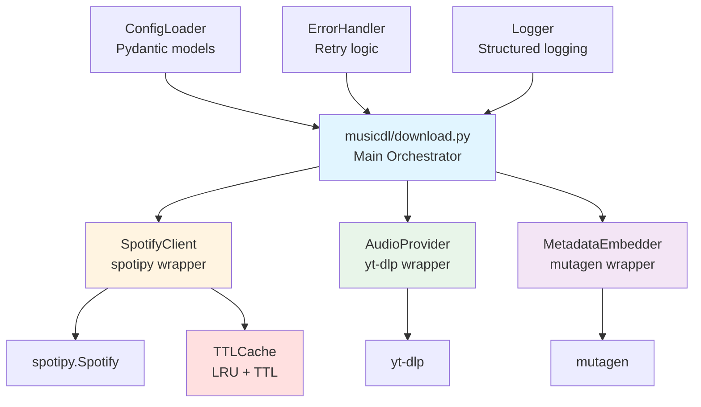

# Re-implement spotDL for musicdl

## Overview

Re-implement the core spotDL functionality directly in musicdl, replacing the subprocess-based approach with native Python implementation. This will use spotDL's dependencies (spotipy, yt-dlp, mutagen) but implement our own simplified architecture for download orchestration, metadata handling, and provider integration.

## Current State Analysis

### Current Implementation

**File**: [musicdl/download.py](musicdl/download.py)

- Uses subprocess to call spotDL CLI (lines 92-165)
- Hardcoded values (MAX_RETRIES, THREADS, output format)
- Complex string manipulation for CLI arguments
- No proper error handling or logging
- Configuration split between `config.yaml` and `config.json`

**Dependencies**: spotDL package (which we'll replace with direct implementation)

### Target Architecture

Simplified architecture compared to spotDL:




## Implementation Plan

### 1. Create Core Module Structure

**New Directory**: `musicdl/core/`Create simplified core modules:

- `musicdl/core/__init__.py` - Package initialization
- `musicdl/core/spotify_client.py` - Spotify API wrapper (simplified, no singleton)
- `musicdl/core/audio_provider.py` - Audio download provider (yt-dlp wrapper)
- `musicdl/core/metadata.py` - Metadata embedding (mutagen wrapper)
- `musicdl/core/downloader.py` - Main download orchestrator
- `musicdl/core/models.py` - Data models (Song, Album, Playlist)
- `musicdl/core/exceptions.py` - Custom exceptions

### 2. Implement Spotify Client with Caching

**File**: `musicdl/core/cache.py` (new file)Simple in-memory cache with LRU eviction and TTL expiration:

```python
import time
from typing import Dict, Optional, Any
from collections import OrderedDict

class TTLCache:
    """Simple in-memory cache with TTL expiration and LRU eviction."""
    
    def __init__(self, max_size: int = 1000, ttl_seconds: int = 3600):
        """
        Initialize cache.
        
        Args:
            max_size: Maximum number of entries (LRU eviction when exceeded)
            ttl_seconds: Time-to-live in seconds (entries expire after this time)
        """
        self.max_size = max_size
        self.ttl_seconds = ttl_seconds
        self._cache: OrderedDict[str, tuple[float, Any]] = OrderedDict()
    
    def get(self, key: str) -> Optional[Any]:
        """Get value from cache if not expired."""
        if key not in self._cache:
            return None
        
        timestamp, value = self._cache[key]
        
        # Check if expired
        if time.time() - timestamp > self.ttl_seconds:
            del self._cache[key]
            return None
        
        # Move to end (most recently used)
        self._cache.move_to_end(key)
        return value
    
    def set(self, key: str, value: Any) -> None:
        """Set value in cache with current timestamp."""
        # Remove if exists
        if key in self._cache:
            del self._cache[key]
        
        # Evict oldest if at capacity
        if len(self._cache) >= self.max_size:
            self._cache.popitem(last=False)  # Remove oldest (first item)
        
        # Add new entry
        self._cache[key] = (time.time(), value)
    
    def clear(self) -> None:
        """Clear all cache entries."""
        self._cache.clear()
    
    def cleanup_expired(self) -> None:
        """Remove all expired entries."""
        current_time = time.time()
        expired_keys = [
            key for key, (timestamp, _) in self._cache.items()
            if current_time - timestamp > self.ttl_seconds
        ]
        for key in expired_keys:
            del self._cache[key]
```

**File**: `musicdl/core/spotify_client.py`Simplified wrapper around spotipy with integrated caching:

```python
from spotipy import Spotify
from spotipy.oauth2 import SpotifyClientCredentials
from typing import Dict, List, Optional
from musicdl.core.cache import TTLCache

class SpotifyClient:
    """Simplified Spotify API client wrapper with caching."""
    
    def __init__(self, client_id: str, client_secret: str, 
                 cache_max_size: int = 1000, cache_ttl: int = 3600):
        """
        Initialize with credentials and cache settings.
        
        Args:
            client_id: Spotify API client ID
            client_secret: Spotify API client secret
            cache_max_size: Maximum cache entries (LRU eviction)
            cache_ttl: Cache TTL in seconds (default: 1 hour)
        """
        credentials = SpotifyClientCredentials(
            client_id=client_id,
            client_secret=client_secret
        )
        self.client = Spotify(auth_manager=credentials)
        self.cache = TTLCache(max_size=cache_max_size, ttl_seconds=cache_ttl)
    
    def _get_cached_or_fetch(self, cache_key: str, fetch_func):
        """Get from cache or fetch and cache the result."""
        # Try cache first
        cached = self.cache.get(cache_key)
        if cached is not None:
            return cached
        
        # Fetch from API
        result = fetch_func()
        
        # Cache the result
        self.cache.set(cache_key, result)
        
        return result
    
    def get_track(self, track_id: str) -> Dict:
        """Get track metadata (cached)."""
        cache_key = f"track:{track_id}"
        return self._get_cached_or_fetch(
            cache_key,
            lambda: self.client.track(track_id)
        )
    
    def get_album(self, album_id: str) -> Dict:
        """Get album metadata (cached)."""
        cache_key = f"album:{album_id}"
        return self._get_cached_or_fetch(
            cache_key,
            lambda: self.client.album(album_id)
        )
    
    def get_playlist(self, playlist_id: str) -> Dict:
        """Get playlist metadata (cached)."""
        cache_key = f"playlist:{playlist_id}"
        return self._get_cached_or_fetch(
            cache_key,
            lambda: self.client.playlist(playlist_id)
        )
    
    def get_artist_albums(self, artist_id: str) -> List[Dict]:
        """Get all albums for an artist (cached)."""
        cache_key = f"artist_albums:{artist_id}"
        return self._get_cached_or_fetch(
            cache_key,
            lambda: self.client.artist_albums(artist_id, limit=50)["items"]
        )
    
    def clear_cache(self) -> None:
        """Clear the cache (useful for testing or forced refresh)."""
        self.cache.clear()
```

**Key Features**:

- No singleton pattern (create instance per use)
- Simple in-memory cache with LRU and TTL support
- No external dependencies (uses only stdlib: `time`, `collections.OrderedDict`)
- Configurable cache size and TTL via constructor
- Automatic cache key generation per API method
- Direct spotipy usage without abstraction layers

### 3. Implement Audio Provider

**File**: `musicdl/core/audio_provider.py`Wrapper around yt-dlp for audio downloads:

```python
import yt_dlp
from pathlib import Path
from typing import Optional

class AudioProvider:
    """Audio download provider using yt-dlp."""
    
    def __init__(self, output_format: str = "mp3", bitrate: str = "128k"):
        """Initialize with format and bitrate settings."""
        
    def search(self, query: str) -> Optional[str]:
        """Search for audio URL matching query."""
        
    def download(self, url: str, output_path: Path) -> Path:
        """Download audio to output path."""
```

**Key Features**:

- Direct yt-dlp usage
- Support for YouTube, YouTube Music, SoundCloud
- Format conversion via yt-dlp/FFmpeg
- Simple search and download interface

### 4. Implement Metadata Embedder

**File**: `musicdl/core/metadata.py`Wrapper around mutagen for metadata embedding:

```python
from mutagen import File
from mutagen.id3 import ID3, TIT2, TPE1, TALB, APIC
from pathlib import Path
from typing import Dict, Optional

class MetadataEmbedder:
    """Metadata embedding using mutagen."""
    
    def embed(self, file_path: Path, metadata: Dict, cover_url: Optional[str] = None):
        """Embed metadata into audio file."""
        # Extract: title, artist, album, track_number, etc.
        # Download cover art if provided
        # Embed using mutagen
```

**Key Features**:

- Support MP3, FLAC, M4A formats
- Album art embedding
- ID3 tag support
- Simplified API (no complex format detection)

### 5. Implement Download Orchestrator

**File**: `musicdl/core/downloader.py`Main download coordination:

```python
from typing import List, Tuple, Optional
from pathlib import Path
import logging

class Downloader:
    """Main download orchestrator."""
    
    def __init__(self, config: DownloadSettings):
        """Initialize with configuration."""
        self.spotify = SpotifyClient(
            config.client_id, 
            config.client_secret,
            cache_max_size=config.cache_max_size,
            cache_ttl=config.cache_ttl
        )
        self.audio = AudioProvider(config.format, config.bitrate)
        self.metadata = MetadataEmbedder()
        
    def download_track(self, track_url: str) -> Tuple[bool, Optional[Path]]:
        """Download a single track."""
        # 1. Get metadata from Spotify
        # 2. Search for audio using audio provider
        # 3. Download audio file
        # 4. Embed metadata
        # Return (success, file_path)
        
    def download_album(self, album_url: str) -> List[Tuple[bool, Optional[Path]]]:
        """Download all tracks in an album."""
        
    def download_playlist(self, playlist_url: str, create_m3u: bool = False) -> List[Tuple[bool, Optional[Path]]]:
        """Download all tracks in a playlist."""
        
    def download_artist(self, artist_url: str) -> List[Tuple[bool, Optional[Path]]]:
        """Download all albums for an artist."""
```

**Key Features**:

- Clean orchestration logic
- Error handling per step
- Progress tracking
- Retry logic integration

### 7. Create Data Models

**File**: `musicdl/core/models.py`Simplified data models:

```python
from dataclasses import dataclass
from typing import List, Optional

@dataclass
class Song:
    """Song metadata model."""
    title: str
    artist: str
    album: str
    track_number: int
    duration: int
    spotify_url: str
    cover_url: Optional[str] = None
    
@dataclass
class DownloadResult:
    """Download operation result."""
    success: bool
    file_path: Optional[Path] = None
    error: Optional[str] = None
    song: Optional[Song] = None
```


### 8. Enhance Configuration

**File**: [musicdl/config.yaml

](musicdl/config.yaml)Migrate all settings to config.yaml (version 1.2):

```yaml
version: 1.2

download:
  # Spotify credentials
  client_id: "..."
  client_secret: "..."
  
  # Download settings
  threads: 4
  max_retries: 3
  format: "mp3"
  bitrate: "128k"
  output: "{artist}/{album}/{track-number} - {title}.{output-ext}"
  
  # Provider settings
  audio_providers: ["youtube-music", "youtube"]
  
  # Cache settings
  cache_max_size: 1000  # Maximum cached entries (LRU eviction)
  cache_ttl: 3600  # Cache TTL in seconds (1 hour)
  
  # File management
  overwrite: "skip"  # skip, overwrite, metadata
  
songs: []
artists: []
playlists: []
```

**File**: `musicdl/core/config.py`Pydantic models for configuration:

```python
from pydantic import BaseModel
from typing import List, Literal

class DownloadSettings(BaseModel):
    """Download configuration settings."""
    client_id: str
    client_secret: str
    threads: int = 4
    max_retries: int = 3
    format: str = "mp3"
    bitrate: str = "128k"
    output: str = "{artist}/{album}/{track-number} - {title}.{output-ext}"
    audio_providers: List[str] = ["youtube-music"]
    cache_max_size: int = 1000  # Maximum cached entries
    cache_ttl: int = 3600  # Cache TTL in seconds (1 hour)
    overwrite: Literal["skip", "overwrite", "metadata"] = "skip"

class MusicSource(BaseModel):
    """Music source entry."""
    name: str
    url: str

class MusicDLConfig(BaseModel):
    """Main configuration model."""
    version: Literal["1.2"]
    download: DownloadSettings
    songs: List[MusicSource] = []
    artists: List[MusicSource] = []
    playlists: List[MusicSource] = []
```


### 9. Refactor Main Download Script

**File**: [musicdl/download.py

](musicdl/download.py)Complete rewrite:

```python
import logging
from pathlib import Path
from musicdl.core.downloader import Downloader
from musicdl.core.config import MusicDLConfig, load_config
from musicdl.core.exceptions import DownloadError, ConfigError

def setup_logging(log_level: str):
    """Configure structured logging."""
    
def process_downloads(config: MusicDLConfig) -> Dict:
    """Orchestrate all downloads."""
    downloader = Downloader(config.download)
    results = {
        "songs": {"success": 0, "failed": 0},
        "artists": {"success": 0, "failed": 0},
        "playlists": {"success": 0, "failed": 0}
    }
    
    # Process songs
    for song in config.songs:
        success, path = downloader.download_track(song.url)
        # Update results, log progress
        
    # Process artists
    for artist in config.artists:
        tracks = downloader.download_artist(artist.url)
        # Update results
        
    # Process playlists
    for playlist in config.playlists:
        tracks = downloader.download_playlist(playlist.url, create_m3u=True)
        # Update results
        
    return results

def main():
    """Main entry point."""
    # Load config
    # Setup logging
    # Process downloads
    # Print summary
```

**Key Improvements**:

- No subprocess calls
- Proper error handling with retries
- Structured logging
- Clean iteration logic
- Type-safe configuration

### 10. Error Handling and Retry Logic

**File**: `musicdl/core/exceptions.py`Custom exceptions:

```python
class MusicDLError(Exception):
    """Base exception."""
    
class SpotifyError(MusicDLError):
    """Spotify API errors."""
    
class DownloadError(MusicDLError):
    """Download failures."""
    
class MetadataError(MusicDLError):
    """Metadata embedding errors."""
```

**File**: `musicdl/core/downloader.py`Retry logic:

```python
import time
from functools import wraps

def retry_on_failure(max_retries: int = 3):
    """Decorator for retry logic with exponential backoff."""
    def decorator(func):
        @wraps(func)
        def wrapper(*args, **kwargs):
            for attempt in range(1, max_retries + 1):
                try:
                    return func(*args, **kwargs)
                except Exception as e:
                    if attempt == max_retries:
                        raise
                    wait_time = 2 ** attempt
                    time.sleep(wait_time)
        return wrapper
    return decorator
```


### 11. Update Dependencies

**File**: [musicdl/requirements.txt

](musicdl/requirements.txt)Remove spotDL, keep dependencies:

```txt
# Core dependencies (from spotDL)
spotipy>=2.25.0
yt-dlp>=2025.3.0
mutagen>=1.47.0

# Configuration and utilities
pydantic>=2.11.0
PyYAML>=6.0.0
```


### 12. Update Documentation

**File**: [musicdl/README.md

](musicdl/README.md)Update with:

- New architecture explanation
- Configuration format (version 1.2)
- No dependency on spotDL package
- Direct implementation details

## Key Simplifications vs spotDL

1. **No Singleton Pattern**: Create instances as needed
2. **No Complex Provider Abstraction**: Direct yt-dlp usage, simpler interface
3. **No Async/Threading Complexity**: Use simple threading or sequential processing
4. **Simplified Configuration**: Single config.yaml, no JSON config
5. **Direct Dependencies**: Use spotipy, yt-dlp, mutagen directly
6. **Focused Features**: Only implement what musicdl needs (no web UI, no sync, etc.)

## Files to Create

- `musicdl/core/__init__.py`
- `musicdl/core/cache.py` - TTL cache implementation
- `musicdl/core/spotify_client.py`
- `musicdl/core/audio_provider.py`
- `musicdl/core/metadata.py`
- `musicdl/core/downloader.py`
- `musicdl/core/models.py`
- `musicdl/core/exceptions.py`
- `musicdl/core/config.py`

## Files to Modify

- [musicdl/download.py](musicdl/download.py) - Complete rewrite
- [musicdl/config.yaml](musicdl/config.yaml) - Add download section, version 1.2
- [musicdl/requirements.txt](musicdl/requirements.txt) - Remove spotdl, keep dependencies
- [musicdl/README.md](musicdl/README.md) - Update documentation

## Files to Remove

- [musicdl/config.json](musicdl/config.json) - No longer needed

## Testing Considerations

1. **Unit Tests**: Test each core module independently
2. **Integration Tests**: Test full download flow
3. **Error Scenarios**: Test retry logic, network failures, invalid URLs
4. **Configuration Validation**: Test Pydantic model validation
5. **Format Support**: Test MP3, FLAC, M4A metadata embedding

## Implementation Order

1. Create core module structure and data models
2. Implement Spotify client wrapper
3. Implement audio provider wrapper
4. Implement metadata embedder
5. Implement download orchestrator
6. Create configuration models and loader
7. Refactor main download.py script
8. Add error handling and retry logic
9. Update configuration file format
10. Update dependencies and documentation
11. Test thoroughly
12. Remove config.json

## Risks and Mitigation

- **Risk**: yt-dlp API changes
- **Mitigation**: Use stable yt-dlp features, pin version in requirements
- **Risk**: Spotify API rate limiting
- **Mitigation**: Implement retry logic with exponential backoff, respect rate limits
- **Risk**: Metadata embedding format issues