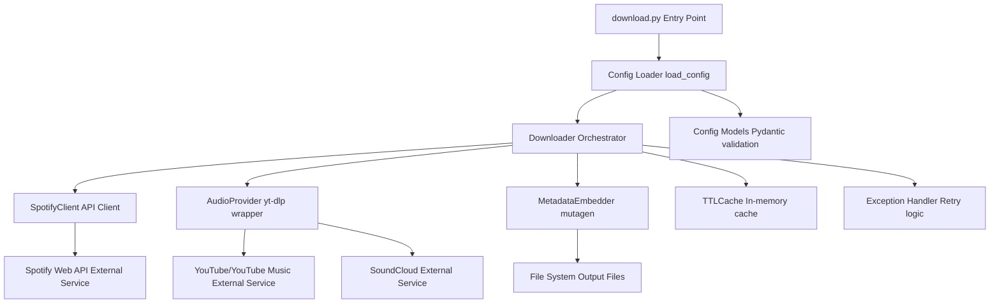
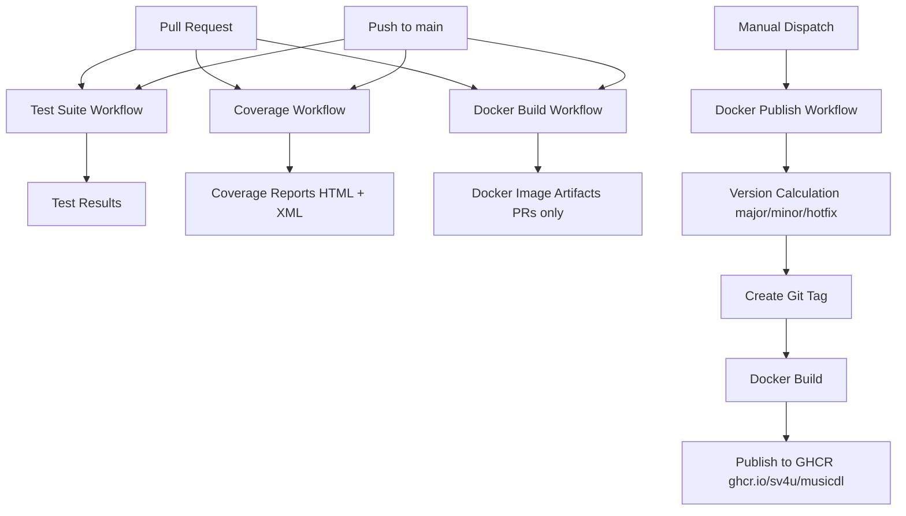

# `musicdl`


Personal music downloader with native Python implementation (no spotDL dependency).

## Overview

musicdl downloads music from Spotify by sourcing audio from YouTube and other
providers, then embedding metadata into the downloaded files. This is a
simplified, self-contained implementation that uses spotDL's dependencies
(spotipy, yt-dlp, mutagen) directly without requiring the spotDL package.

## Features

- Downloads tracks, albums, playlists, and artist discographies from Spotify
- Sources audio from YouTube Music, YouTube, and SoundCloud
- Embeds metadata (album art, track information) using mutagen
- Supports multiple audio formats (MP3, FLAC, M4A, Opus)
- In-memory caching with LRU eviction and TTL expiration
- Configurable via single YAML file
- Structured logging and error handling

## Architecture

The application uses a simplified, modular architecture:

- **Core Modules**: Spotify client, audio provider, metadata embedder, download orchestrator
- **Caching**: Simple in-memory cache with TTL and LRU support (no external dependencies)
- **Configuration**: Pydantic models for type-safe configuration validation
- **Error Handling**: Custom exceptions with retry logic and exponential backoff

### Application Architecture



## Installation

1. Clone repository:

    ```bash
    git clone git@github.com:sv4u/musicdl.git
    cd musicdl
    ```

2. Install dependencies:

    ```bash
    pip install -r requirements.txt
    ```

3. Configure `config.yaml` with your Spotify API credentials (see Configuration section)

**Note**: This project uses GitHub Actions for automated testing, code coverage,
and Docker image building. All workflows run automatically on pull requests
and pushes to the `main` branch. See the [CI/CD](#cicd) section for more
details.

## Configuration

The tool uses a single `config.yaml` file (version 1.2) for all settings.

### Basic Structure

```yaml
version: 1.2

download:
  # Spotify credentials
  client_id: "your_client_id"
  client_secret: "your_client_secret"
  
  # Download settings
  threads: 4
  max_retries: 3
  format: "mp3"
  bitrate: "128k"
  output: "{artist}/{album}/{track-number} - {title}.{output-ext}"
  
  # Provider settings
  audio_providers: ["youtube-music", "youtube"]
  
  # Cache settings
  cache_max_size: 1000
  cache_ttl: 3600
  
  # File management
  overwrite: "skip"  # skip, overwrite, metadata

songs: []
artists: []
playlists: []
```

### Download Settings

All download settings are configured under the `download` section:

- `client_id` / `client_secret`: Spotify API credentials (required)
- `threads`: Number of parallel downloads (default: 4)
- `max_retries`: Retry attempts for failed downloads (default: 3)
- `format`: Audio format - mp3, flac, m4a, opus (default: mp3)
- `bitrate`: Audio bitrate - e.g., "128k", "320k" (default: "128k")
- `output`: File naming pattern with placeholders (see below)
- `audio_providers`: List of audio sources to try in order (default: ["youtube-music"])
- `cache_max_size`: Maximum cached Spotify API responses (default: 1000)
- `cache_ttl`: Cache expiration time in seconds (default: 3600 = 1 hour)
- `overwrite`: Behavior when file exists - "skip", "overwrite", or "metadata"
  (default: "skip")

### Output Template Placeholders

- `{artist}` - Artist name
- `{title}` - Track title
- `{album}` - Album name
- `{track-number}` - Track number (zero-padded)
- `{disc-number}` - Disc number
- `{album-artist}` - Album artist name
- `{year}` - Release year
- `{date}` - Release date
- `{output-ext}` - File extension based on format

### Music Sources

- `songs`: List of individual songs `{name: url}`
- `artists`: List of artists to download entire discography
- `playlists`: List of playlists (creates M3U files)

## Usage

Run the download script with your configuration file:

```bash
python3 download.py config.yaml
```

The script will:

1. Load and validate the configuration
2. Process all songs, artists, and playlists
3. Display a summary of successful and failed downloads

## Docker

### Building the Image

Build the Docker image using the provided Dockerfile:

```bash
docker build -f musicdl.Dockerfile -t musicdl:latest .
```

**Note**: Docker images are automatically built on pull requests and pushes to
`main` via GitHub Actions. Published images are available at
`ghcr.io/sv4u/musicdl`. See the [CI/CD](#cicd) section for details on automated
builds and publishing.

### Basic Usage

Run the container with a volume mount for your music library:

```bash
docker run --rm -v /path/to/music/library:/download musicdl:latest
```

The container will automatically execute `download.py` with the built-in
configuration file. Downloaded music will be saved to the mounted volume at
`/download`.

### Custom Volume Mount

You can mount any directory as the download location:

```bash
docker run --rm \
  -v /mnt/storage/music:/download \
  musicdl:latest
```

### Configuration Override

The image includes a default `config.yaml` file, but you can override it by
mounting your own configuration file:

```bash
docker run --rm \
  -v /path/to/music/library:/download \
  -v /path/to/your/config.yaml:/scripts/config.yaml:ro \
  musicdl:latest
```

Alternatively, you can override the config path using the `CONFIG_PATH`
environment variable:

```bash
docker run --rm \
  -v /path/to/music/library:/download \
  -v /path/to/your/config.yaml:/custom/config.yaml:ro \
  -e CONFIG_PATH=/custom/config.yaml \
  musicdl:latest
```

### Docker Compose

You can also use Docker Compose. Create a `docker-compose.yml` file:

```yaml
services:
  musicdl:
    image: musicdl:latest
    build:
      context: .
      dockerfile: ./musicdl.Dockerfile
    volumes:
      - /path/to/music/library:/download:rw
      # Optional: override config
      # - /path/to/config.yaml:/scripts/config.yaml:ro
    restart: unless-stopped
```

Then run:

```bash
docker compose up -d
```

## TrueNAS Scale Deployment

musicdl can be deployed on TrueNAS Scale as a custom application. Multiple
deployment methods are available:

- **Helm Chart**: Production-ready Kubernetes deployment (recommended)
- **Docker Compose**: Simple compose-based deployment
- **Manual Setup**: Step-by-step guide for TrueNAS Scale UI

For detailed instructions, see the [TrueNAS Scale Deployment Guide](truenas-scale/README.md).

### Quick Start (Helm Chart)

```bash
# Install using Helm
helm install musicdl ./truenas-scale/helm/musicdl \
  --set downloadVolume.path=/mnt/pool/datasets/music
```

### Quick Start (Docker Compose)

1. Copy `truenas-scale/docker-compose.yml` to your TrueNAS Scale system
2. Update the volume paths in the compose file
3. Deploy via TrueNAS Scale Apps interface or using `docker compose`

## Dependencies

- **spotipy**: Spotify Web API client
- **yt-dlp**: YouTube downloader
- **mutagen**: Audio metadata manipulation
- **pydantic**: Configuration validation
- **PyYAML**: YAML file parsing
- **requests**: HTTP requests for cover art

## CI/CD

This project uses GitHub Actions for automated testing, code coverage, Docker
image building, and publishing.

### Workflows

1. **Test Suite** - Runs pytest on all pull requests and pushes to `main`
2. **Code Coverage** - Generates and uploads coverage reports (HTML and XML) on
   all pull requests and pushes to `main`
3. **Docker Build** - Builds Docker images on pull requests and pushes to
   `main` (images are not published in this workflow)
4. **Docker Publish** - Manually triggered workflow that calculates semantic
   versions, creates git tags, and publishes Docker images to GitHub Container
   Registry (GHCR)

### Workflow Architecture



### Docker Publishing

To publish a new Docker image:

1. Navigate to the [Actions](https://github.com/sv4u/musicdl/actions) tab in GitHub
2. Select the "Docker Publish" workflow from the left sidebar
3. Click "Run workflow" button (top right)
4. Select the release type:
   - **major**: Increments major version, resets minor and patch to 0
     (e.g., v1.2.3 → v2.0.0)
   - **minor**: Increments minor version, resets patch to 0
     (e.g., v1.2.3 → v1.3.0)
   - **hotfix**: Increments patch version only (e.g., v1.2.3 → v1.2.4)
5. Optionally enable dry-run mode to test without creating tags or publishing images
6. Click "Run workflow" to start

**What the workflow does**:

1. Validates branch is `main` and working directory is clean
2. Calculates the next version based on the selected release type
3. Validates that there are commits to include in the release
4. Displays a preview of the release (version, commit count)
5. Creates and pushes a git tag with the new version
6. Builds Docker image from `musicdl.Dockerfile`
7. Publishes Docker image to GHCR with version and latest tags
8. Verifies the image was published successfully

**Dry-Run Mode**:

The workflow supports a dry-run mode that allows you to test the entire release
process without creating tags or publishing images. This is useful for:

- Validating version calculation logic
- Testing workflow changes in pull requests
- Debugging release issues without creating test releases

In dry-run mode, the workflow will:

- ✅ Validate branch and working directory
- ✅ Calculate and display next version
- ✅ Show preview with commit count
- ✅ Build Docker image (but not push)

In dry-run mode, the workflow will NOT:

- ❌ Create git tags
- ❌ Publish Docker images
- ❌ Make any changes to the repository

**Published Images**:

Published Docker images are available at:

- `ghcr.io/sv4u/musicdl:v{version}` (e.g., `ghcr.io/sv4u/musicdl:v1.2.3`)
- `ghcr.io/sv4u/musicdl:latest` (always points to the latest published version)

## Dependency Management

This project uses
[Dependabot](https://docs.github.com/en/code-security/dependabot) to
automatically manage dependency updates.

### Current Configuration

- **Security Updates**: Enabled - Automatically creates PRs for security
  vulnerabilities
- **Version Updates**: Disabled - Configuration ready in
  `.github/dependabot.yml`
- **Update Schedule**: Weekly on Mondays at 9:00 AM UTC
- **Package Managers**: pip (Python), Docker, GitHub Actions

### Enabling Version Updates

To enable automatic version updates:

1. Navigate to
   [Repository Settings → Security](https://github.com/sv4u/musicdl/settings/security)
2. Under "Code security and analysis", find "Dependabot version updates"
3. Click "Enable" to activate version updates
4. The configuration in `.github/dependabot.yml` will automatically take effect

### Viewing Dependabot PRs

View all Dependabot pull requests:
[Dependabot PRs](https://github.com/sv4u/musicdl/pulls?q=is%3Apr+is%3Aopen+author%3Aapp%2Fdependabot)

### Configuration Details

The Dependabot configuration (`.github/dependabot.yml`) includes:

- **Grouping**: Related dependencies are grouped into single PRs
- **Update Limits**: Maximum 5 PRs for pip, 3 for Docker/GitHub Actions
- **Commit Format**: Uses conventional commits (`deps:` for dependencies,
  `ci:` for GitHub Actions)
- **Labels**: Automatic labeling for easy filtering
- **Ignore Rules**: Major version updates are ignored to prevent breaking
  changes

## Key Differences from spotDL

1. **No spotDL Package**: Direct implementation using spotDL's dependencies
2. **Simplified Architecture**: No singleton patterns, simpler provider
   abstraction
3. **Single Configuration**: One YAML file (version 1.2) instead of split config
4. **In-Memory Caching**: Simple cache implementation (no file persistence)
5. **Focused Features**: Only core download functionality (no web UI, sync,
   etc.)

## License

See LICENSE file.
