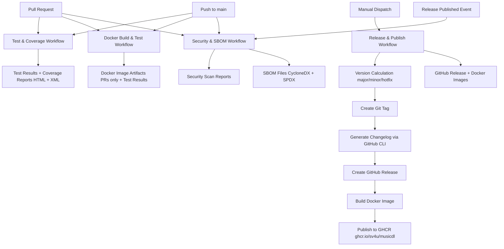

# `musicdl`


Personal music downloader with native Python implementation (no spotDL dependency).

## Overview

musicdl downloads music from Spotify by sourcing audio from YouTube and other
providers, then embedding metadata into the downloaded files. This is a
simplified, self-contained implementation that uses spotDL's dependencies
(spotipy, yt-dlp, mutagen) directly without requiring the spotDL package.

## Features

- Downloads tracks, albums, playlists, and artist discographies from Spotify
- Sources audio from YouTube Music, YouTube, and SoundCloud
- Embeds metadata (album art, track information) using mutagen
- Supports multiple audio formats (MP3, FLAC, M4A, Opus)
- In-memory caching with LRU eviction and TTL expiration
- Configurable via single YAML file
- Structured logging and error handling

## Architecture

The application uses a simplified, modular architecture:

- **Core Modules**: Spotify client, audio provider, metadata embedder, download orchestrator
- **Caching**: Simple in-memory cache with TTL and LRU support (no external dependencies)
- **Configuration**: Pydantic models for type-safe configuration validation
- **Error Handling**: Custom exceptions with retry logic and exponential backoff

### Application Architecture


## Installation

1. Clone repository:

    ```bash
    git clone git@github.com:sv4u/musicdl.git
    cd musicdl
    ```

2. Install dependencies:

    ```bash
    pip install -r requirements.txt
    ```

3. Configure `config.yaml` with your Spotify API credentials (see Configuration section)

**Note**: This project uses GitHub Actions for automated testing, code coverage,
and Docker image building. All workflows run automatically on pull requests
and pushes to the `main` branch. See the [CI/CD](#cicd) section for more
details.

## Configuration

The tool uses a single `config.yaml` file (version 1.2) for all settings.

### Basic Structure

```yaml
version: 1.2

download:
  # Spotify API credentials
  # These should be provided via environment variables:
  #   SPOTIFY_CLIENT_ID
  #   SPOTIFY_CLIENT_SECRET
  # For local development, you can still add them here (not recommended for production)
  # client_id: "your_client_id"
  # client_secret: "your_client_secret"
  
  # Download settings
  threads: 4
  max_retries: 3
  format: "mp3"
  bitrate: "128k"
  output: "{artist}/{album}/{track-number} - {title}.{output-ext}"
  
  # Provider settings
  audio_providers: ["youtube-music", "youtube"]
  
  # Cache settings
  cache_max_size: 1000
  cache_ttl: 3600
  
  # File management
  overwrite: "skip"  # skip, overwrite, metadata

songs: []
artists: []
playlists: []
```

### Environment Variables

Spotify API credentials should be provided via environment variables for security:

- `SPOTIFY_CLIENT_ID`: Spotify API client ID (required)
- `SPOTIFY_CLIENT_SECRET`: Spotify API client secret (required)

**Credential Resolution Order:**
1. Environment variables (`SPOTIFY_CLIENT_ID`, `SPOTIFY_CLIENT_SECRET`) - highest priority
2. Configuration file (`download.client_id`, `download.client_secret`) - fallback for local development

**Setting Environment Variables:**

**Local Development:**
```bash
# Option 1: Export in shell
export SPOTIFY_CLIENT_ID="your_client_id"
export SPOTIFY_CLIENT_SECRET="your_client_secret"

# Option 2: Use .env file (recommended)
# Copy .env.example to .env and fill in your credentials
cp .env.example .env
# Edit .env with your credentials
```

**Docker:**
```bash
# Pass via -e flags
docker run --rm \
  -e SPOTIFY_CLIENT_ID="your_client_id" \
  -e SPOTIFY_CLIENT_SECRET="your_client_secret" \
  -v /path/to/music:/download \
  musicdl:latest

# Or use .env file
docker run --rm \
  --env-file .env \
  -v /path/to/music:/download \
  musicdl:latest
```

**Docker Compose:**
```yaml
services:
  musicdl:
    environment:
      - SPOTIFY_CLIENT_ID=${SPOTIFY_CLIENT_ID}
      - SPOTIFY_CLIENT_SECRET=${SPOTIFY_CLIENT_SECRET}
```

### Download Settings

All download settings are configured under the `download` section:

- `client_id` / `client_secret`: Spotify API credentials (optional in config file, required via environment variables or config file)
- `threads`: Number of parallel downloads (default: 4)
- `max_retries`: Retry attempts for failed downloads (default: 3)
- `format`: Audio format - mp3, flac, m4a, opus (default: mp3)
- `bitrate`: Audio bitrate - e.g., "128k", "320k" (default: "128k")
- `output`: File naming pattern with placeholders (see below)
- `audio_providers`: List of audio sources to try in order (default: ["youtube-music"])
- `cache_max_size`: Maximum cached Spotify API responses (default: 1000)
- `cache_ttl`: Cache expiration time in seconds (default: 3600 = 1 hour)
- `overwrite`: Behavior when file exists - "skip", "overwrite", or "metadata"
  (default: "skip")

### Output Template Placeholders

- `{artist}` - Artist name
- `{title}` - Track title
- `{album}` - Album name
- `{track-number}` - Track number (zero-padded)
- `{disc-number}` - Disc number
- `{album-artist}` - Album artist name
- `{year}` - Release year
- `{date}` - Release date
- `{output-ext}` - File extension based on format

### Music Sources

- `songs`: List of individual songs `{name: url}`
- `artists`: List of artists to download discography (albums and singles only, excludes compilations and featured appearances)
- `playlists`: List of playlists (creates M3U files)

## Usage

Run the download script with your configuration file:

```bash
python3 download.py config.yaml
```

The script will:

1. Load and validate the configuration
2. Process all songs, artists, and playlists
3. Display a summary of successful and failed downloads

## Docker

### Building the Image

Build the Docker image using the provided Dockerfile:

```bash
docker build -f musicdl.Dockerfile -t musicdl:latest .
```

**Note**: Docker images are automatically built on pull requests and pushes to
`main` via GitHub Actions. Published images are available at
`ghcr.io/sv4u/musicdl`. See the [CI/CD](#cicd) section for details on automated
builds and publishing.

### Basic Usage

Run the container with a volume mount for your music library and Spotify credentials:

```bash
docker run --rm \
  -e SPOTIFY_CLIENT_ID="your_client_id" \
  -e SPOTIFY_CLIENT_SECRET="your_client_secret" \
  -v /path/to/music/library:/download \
  musicdl:latest
```

The container will automatically execute `download.py` with the built-in
configuration file. Downloaded music will be saved to the mounted volume at
`/download`.

**Note:** Spotify API credentials are required via environment variables. See
[Environment Variables](#environment-variables) section for more details.

### Custom Volume Mount

You can mount any directory as the download location:

```bash
docker run --rm \
  -v /mnt/storage/music:/download \
  musicdl:latest
```

### Configuration Override

The image includes a default `config.yaml` file, but you can override it by
mounting your own configuration file:

```bash
docker run --rm \
  -e SPOTIFY_CLIENT_ID="your_client_id" \
  -e SPOTIFY_CLIENT_SECRET="your_client_secret" \
  -v /path/to/music/library:/download \
  -v /path/to/your/config.yaml:/scripts/config.yaml:ro \
  musicdl:latest
```

Alternatively, you can override the config path using the `CONFIG_PATH`
environment variable:

```bash
docker run --rm \
  -e SPOTIFY_CLIENT_ID="your_client_id" \
  -e SPOTIFY_CLIENT_SECRET="your_client_secret" \
  -v /path/to/music/library:/download \
  -v /path/to/your/config.yaml:/custom/config.yaml:ro \
  -e CONFIG_PATH=/custom/config.yaml \
  musicdl:latest
```

### Troubleshooting

**Error: Missing Spotify credentials**
- Ensure `SPOTIFY_CLIENT_ID` and `SPOTIFY_CLIENT_SECRET` environment variables are set
- Verify credentials are not empty strings
- Check that credentials are correctly passed to the container (use `docker run -e` or `--env-file`)
- For local development, you can still add credentials to `config.yaml` as a fallback

### Docker Compose

You can also use Docker Compose. Create a `docker-compose.yml` file:

```yaml
services:
  musicdl:
    image: musicdl:latest
    build:
      context: .
      dockerfile: ./musicdl.Dockerfile
    volumes:
      - /path/to/music/library:/download:rw
      # Optional: override config
      # - /path/to/config.yaml:/scripts/config.yaml:ro
    restart: unless-stopped
```

Then run:

```bash
docker compose up -d
```

## TrueNAS Scale Deployment

musicdl can be deployed on TrueNAS Scale as a custom application. Multiple
deployment methods are available:

- **Helm Chart**: Production-ready Kubernetes deployment (recommended)
- **Docker Compose**: Simple compose-based deployment
- **Manual Setup**: Step-by-step guide for TrueNAS Scale UI

For detailed instructions, see the [TrueNAS Scale Deployment Guide](truenas-scale/README.md).

### Quick Start (Helm Chart)

```bash
# Install using Helm
helm install musicdl ./truenas-scale/helm/musicdl \
  --set downloadVolume.path=/mnt/pool/datasets/music
```

### Quick Start (Docker Compose)

1. Copy `truenas-scale/docker-compose.yml` to your TrueNAS Scale system
2. Update the volume paths in the compose file
3. Deploy via TrueNAS Scale Apps interface or using `docker compose`

## Dependencies

- **spotipy**: Spotify Web API client
- **yt-dlp**: YouTube downloader
- **mutagen**: Audio metadata manipulation
- **pydantic**: Configuration validation
- **PyYAML**: YAML file parsing
- **requests**: HTTP requests for cover art

## CI/CD

This project uses GitHub Actions for automated testing, code coverage, Docker
image building, and publishing.

### Workflows

1. **Test & Coverage** - Runs pytest with coverage on all pull requests and pushes to `main`. Generates and uploads coverage reports (HTML and XML)
2. **Docker Build & Test** - Builds Docker images and runs comprehensive smoke and functional tests on pull requests and pushes to `main` (images are not published in this workflow)
3. **Release & Publish** - Manually triggered workflow that creates GitHub releases with automatically generated changelogs and publishes Docker images to GHCR in a single workflow
4. **Security & SBOM** - Performs security scanning (Trivy, Grype) and generates SBOMs (Syft, Trivy) for source code and Docker images on pull requests, pushes to `main`, and release events

### Workflow Architecture



### Release Process

The Release & Publish workflow creates GitHub releases with automatically generated changelogs and publishes Docker images in a single workflow.

**Prerequisites**:

- All changes must be merged to the `main` branch
- Working directory must be clean (no uncommitted changes)
- Local branch must be up-to-date with remote `origin/main`

**How to create a release**:

1. Navigate to the [Actions](https://github.com/sv4u/musicdl/actions) tab in GitHub
2. Select the "Release & Publish" workflow from the left sidebar
3. Click "Run workflow" button (top right)
4. Select the release type:
   - **major**: Increments major version, resets minor to 0 (e.g., v0.13 → v1.0)
   - **minor**: Increments minor version (e.g., v0.13 → v0.14)
   - **hotfix**: Increments minor version (same as minor for two-part versioning)
5. Optionally enable dry-run mode to test without creating a release
6. Click "Run workflow" to start

**What the Release & Publish workflow does**:

1. Validates branch and working directory state
2. Calculates the next version based on the selected release type (two-part versioning: vX.Y)
3. Validates that there are commits to include in the release
4. Displays a preview of the release (version, commit count, commit types)
5. Checks if tag already exists (local and remote)
6. Creates and pushes a git tag with the new version
7. Generates changelog from Conventional Commits using GitHub CLI
8. Creates and publishes GitHub release with changelog
9. Verifies the release was created successfully
10. Builds Docker image from `musicdl.Dockerfile`
11. Publishes Docker image to GHCR with version tag and latest tag
12. Verifies the image was published successfully
13. Displays release summary with URLs

**Version Calculation**:

- The workflow uses **two-part versioning** (vX.Y format, e.g., v0.13, v1.0)
- **Major release**: Increments major, resets minor to 0 (e.g., v0.13 → v1.0)
- **Minor/Hotfix release**: Increments minor (e.g., v0.13 → v0.14)
- **First release**: Defaults to v0.1 regardless of release type
- Version format is validated to match `^v[0-9]+\.[0-9]+$` pattern

**Tag Handling**:

- Checks for existing tags (local and remote) before creation to prevent duplicates
- Automatically rolls back tags if release or Docker publish fails after tag creation
- Provides manual cleanup instructions if automatic rollback fails

**Published Images**:

Published Docker images are available at:

- `ghcr.io/sv4u/musicdl:v{version}` (e.g., `ghcr.io/sv4u/musicdl:v0.14`)
- `ghcr.io/sv4u/musicdl:latest` (always points to the latest published version)

**Dry-Run Mode**:

The Release & Publish workflow supports a dry-run mode that allows you to test the entire release process without creating tags, releases, or publishing images. This is useful for:

- Validating version calculation logic
- Testing workflow changes in pull requests
- Debugging release issues without creating test releases

**What runs in dry-run mode**:

- ✅ Branch and working directory validation
- ✅ Version calculation and validation (two-part versioning)
- ✅ Commit range checking (warnings instead of errors if no commits)
- ✅ Tag availability checking
- ✅ Preview of what would be created

**What is skipped in dry-run mode**:

- ❌ Git tag creation and pushing
- ❌ GitHub release creation
- ❌ Docker image building and publishing

**Commit validation in dry-run**:

- In dry-run mode, if there are no commits to release, the workflow will show a warning instead of failing
- This allows you to test the workflow even when no new commits exist
- The dry-run summary will indicate if validation would have failed

### Docker Build & Test

The Docker Build & Test workflow builds Docker images and validates they function correctly.

**Triggers**:

- Pull requests (opened, synchronize, reopened)
- Pushes to `main` branch

**What the workflow does**:

1. Builds Docker image using `musicdl.Dockerfile`
2. Tags images appropriately:
   - PRs: `ghcr.io/sv4u/musicdl:pr-{number}`
   - Main branch: `ghcr.io/sv4u/musicdl:sha-{short-sha}` and `ghcr.io/sv4u/musicdl:latest`
3. **Smoke Tests**:
   - Verifies container can start successfully
   - Tests entrypoint script execution
   - Verifies Python environment (Python 3.12, required packages)
   - Checks required dependencies (ffmpeg, aria2)
   - Verifies directory structure (/scripts, /download)
   - Checks file permissions
4. **Functional Tests**:
   - Creates minimal test configuration
   - Runs download.py with test config
   - Verifies no critical errors occur
5. Saves Docker image as artifact for PRs (for manual testing)

**Test Results**:

- All smoke and functional tests must pass for the workflow to succeed
- Test results are displayed in workflow logs
- Docker images are available as artifacts for PRs (1 day retention)

### Security & SBOM

The Security & SBOM workflow performs comprehensive security scanning and generates Software Bill of Materials (SBOM) for both source code and Docker images.

**Triggers**:

- Pull requests (opened, synchronize, reopened)
- Pushes to `main` branch
- Release events (when releases are published)

**Source Code Security Scanning**:

- Uses **Trivy** to scan repository for vulnerabilities
- Scans dependency files (`requirements.txt`, `test-requirements.txt`)
- Generates security reports in SARIF format
- Uploads scan results as artifacts (30 days retention)
- **Warns on vulnerabilities but does not fail the workflow**

**Docker Image Security Scanning**:

- Uses **Trivy** and **Grype** to scan Docker images
- Generates security reports from both scanners
- Compares results from both scanners
- Uploads scan results as artifacts (30 days retention)
- **Warns on vulnerabilities but does not fail the workflow**

**SBOM Generation from Source Code**:

- Uses **Syft** to generate SBOMs from repository
- Generates SBOMs in CycloneDX and SPDX formats
- Includes all dependencies from `requirements.txt` and `test-requirements.txt`
- Uploads SBOM artifacts (30 days retention)

**SBOM Generation from Docker Image**:

- Uses **Syft** and **Trivy** to generate SBOMs from Docker images
- Generates SBOMs in CycloneDX and SPDX formats
- Includes all packages installed in the Docker image
- Uploads SBOM artifacts (30 days retention)

**For Release Events**:

- Automatically attaches SBOMs to GitHub releases
- Scans the published Docker image from GHCR
- All SBOMs are available as release assets

### Personal Access Token (PAT) Setup

**Note**: The Release & Publish workflow no longer requires a PAT since Docker publishing is integrated into the same workflow. The workflow uses `GITHUB_TOKEN` for all operations, which simplifies setup and maintenance.

**Security Best Practices**:

- Use fine-grained PATs if available (more secure)
- Set appropriate expiration dates
- Rotate tokens periodically (recommended: before expiration)
- Use minimal required scopes
- Never commit tokens to repository
- Revoke tokens if compromised

**Fallback Behavior**:

- If `RELEASE_PAT` is not configured, the workflow will use `GITHUB_TOKEN` as fallback
- The release will be created successfully, but Docker workflow will NOT trigger automatically
- You can manually trigger Docker workflow if needed
- The workflow will display warnings when using the fallback token

### Troubleshooting Release Workflow

**Issue: Docker workflow not triggering after release**:

- ✅ Check `RELEASE_PAT` secret exists in repository settings
- ✅ Verify PAT has `repo` scope (required)
- ✅ Check PAT hasn't expired (GitHub Settings → Developer settings → Tokens)
- ✅ Review release workflow logs for PAT-related warnings
- ✅ Manually trigger Docker workflow if needed (Actions → Docker Publish)

**Issue: Dry-run mode failing unexpectedly**:

- ✅ Check workflow logs for specific error message
- ✅ Verify you're on `main` branch and up-to-date with remote
- ✅ Ensure working directory is clean (no uncommitted changes)
- ✅ Validate GoReleaser configuration file exists and is valid
- ✅ Check for syntax errors in workflow file

**Issue: Release creation failing with authentication error**:

- ✅ Verify `RELEASE_PAT` secret is correctly configured
- ✅ Check PAT hasn't been revoked or expired
- ✅ Verify PAT has correct scopes (`repo` required)
- ✅ Try regenerating PAT and updating secret
- ✅ Check GitHub API status for outages

**Issue: Tag rollback not working**:

- ✅ Check workflow logs for rollback step execution
- ✅ Verify tag exists before attempting deletion
- ✅ Check repository permissions (contents: write required)
- ✅ Manually delete tag if automatic rollback fails: `git push origin :refs/tags/vX.Y.Z`

**Issue: GoReleaser build failing**:

- ✅ Validate `.goreleaser.yml` configuration
- ✅ Check GoReleaser version compatibility
- ✅ Review build logs for specific platform errors
- ✅ Test GoReleaser locally: `goreleaser check`
- ✅ Verify all required files exist for build

## Dependency Management

This project uses
[Dependabot](https://docs.github.com/en/code-security/dependabot) to
automatically manage dependency updates.

### Current Configuration

- **Security Updates**: Enabled - Automatically creates PRs for security
  vulnerabilities
- **Version Updates**: Disabled - Configuration ready in
  `.github/dependabot.yml`
- **Update Schedule**: Weekly on Mondays at 9:00 AM UTC
- **Package Managers**: pip (Python), Docker, GitHub Actions

### Enabling Version Updates

To enable automatic version updates:

1. Navigate to
   [Repository Settings → Security](https://github.com/sv4u/musicdl/settings/security)
2. Under "Code security and analysis", find "Dependabot version updates"
3. Click "Enable" to activate version updates
4. The configuration in `.github/dependabot.yml` will automatically take effect

### Viewing Dependabot PRs

View all Dependabot pull requests:
[Dependabot PRs](https://github.com/sv4u/musicdl/pulls?q=is%3Apr+is%3Aopen+author%3Aapp%2Fdependabot)

### Configuration Details

The Dependabot configuration (`.github/dependabot.yml`) includes:

- **Grouping**: Related dependencies are grouped into single PRs
- **Update Limits**: Maximum 5 PRs for pip, 3 for Docker/GitHub Actions
- **Commit Format**: Uses conventional commits (`deps:` for dependencies,
  `ci:` for GitHub Actions)
- **Labels**: Automatic labeling for easy filtering
- **Ignore Rules**: Major version updates are ignored to prevent breaking
  changes

## Key Differences from spotDL

1. **No spotDL Package**: Direct implementation using spotDL's dependencies
2. **Simplified Architecture**: No singleton patterns, simpler provider
   abstraction
3. **Single Configuration**: One YAML file (version 1.2) instead of split config
4. **In-Memory Caching**: Simple cache implementation (no file persistence)
5. **Focused Features**: Only core download functionality (no web UI, sync,
   etc.)

## License

See LICENSE file.
