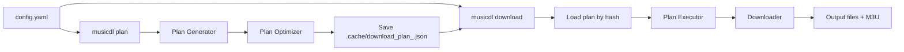

# Architecture

## Overview

musicdl is a CLI-only tool for downloading music from Spotify by sourcing audio from YouTube, YouTube Music, and SoundCloud, then embedding metadata. It uses a plan-based workflow: generate a plan (saved by config hash), then run downloads from that plan. There is no web server or gRPC; the binary provides two main commands: `musicdl plan <config-file>` and `musicdl download <config-file>`.

## CLI Architecture

### Commands

1. **plan** – Load config, compute config hash, run plan generation (Generator + Optimizer), save spec-compliant plan to `.cache/download_plan_<hash>.json`.
2. **download** – Load config, compute hash, load plan by hash (validates match), run Executor to perform downloads and M3U generation.
3. **version** – Print version.

### Flow

### Plan-Based Design

- **Generation**: Config (songs, artists, playlists, albums) → Generator (Spotify client, audio provider) → hierarchical plan → Optimizer (dedup, file checks).
- **Persistence**: Plan saved as spec JSON with `config_hash`, `config_file`, `generated_at`, `downloads`, `playlists`.
- **Execution**: Load plan by config hash; if hash mismatch, exit 2. Executor runs downloads in parallel; M3U files generated per spec.

## Core Modules

### Config & Hash

- **download/config**: Loader supports spec layout (top-level `spotify`, `threads`, `rate_limits`) and legacy `download.client_id`/`client_secret`. Validation: version 1.2, threads 1–16, output must contain `{title}`.
- **download/config/hash.go**: SHA256 of raw config file bytes; first 16 hex chars used for plan filename.

### Plan

- **download/plan**: Models (DownloadPlan, PlanItem), Generator, Optimizer, Executor, spec adapter (PlanToSpec, SpecToPlan), path helpers (GetPlanFilePath, LoadPlanByHash, SavePlanByHash).

### Cache

- **download/cache**: Manager for `.cache/spotify_cache.json`, `youtube_cache.json`, `download_cache.json` with TTL handling and thread-safe load/save.

### Spotify & Audio

- **download/spotify**: Spotify Web API client with rate limiting and caching.
- **download/audio**: yt-dlp-based provider for YouTube/YouTube Music/SoundCloud.
- **download/metadata**: Mutagen-based embedder for MP3, FLAC, M4A, Vorbis/Opus.

## Paths & Environment

- **Working directory**: Current directory or MUSICDL_WORK_DIR.
- **Cache dir**: `.cache` under working dir or MUSICDL_CACHE_DIR.
- **Plan file**: `<cache_dir>/download_plan_<16-hex>.json`.
- **Temp files**: `<cache_dir>/temp/` (created when needed; cleaned after download).

## Exit Codes

- **plan**: 0 success, 1 config error, 2 network error, 3 filesystem error.
- **download**: 0 success, 1 config error, 2 plan not found/hash mismatch, 3 network, 4 filesystem, 5 partial success.

## Key Differences from Previous (Web) Version

- No HTTP server, no gRPC, no Protocol Buffers.
- Single binary; no separate “control platform” or “download service” processes.
- Plan file is keyed by config hash; download rejects plan if config changed.
- CLI-only usage; no web UI or REST API.
