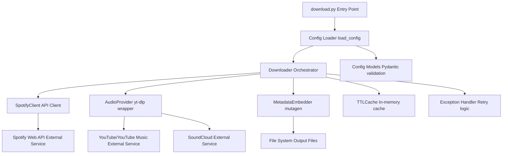

# Architecture

## Overview

musicdl uses a plan-based architecture with parallel execution for efficient music downloads. The application processes downloads in three distinct phases: generation, optimization, and execution.

## Plan-Based Architecture

### Benefits

- **Better Optimization**: Removes duplicates before downloading, checks existing files
- **Improved Parallelization**: Processes all tracks in parallel regardless of source (song, album, playlist)
- **Detailed Progress Tracking**: Real-time per-item progress with status updates
- **Plan Persistence**: Save and resume download plans (when enabled)
- **Better Error Recovery**: Failed items can be retried without reprocessing entire plan

### Architecture Flow

### Three-Phase Process

#### Phase 1: Plan Generation

Converts configuration (songs, artists, playlists, albums) into a structured download plan with hierarchy.

**Components:**

- `PlanGenerator`: Converts configuration to download plan
- `SpotifyClient`: Fetches metadata from Spotify API
- Creates hierarchical structure (artists → albums → tracks, playlists → tracks)

**Output:**

- `DownloadPlan` with all items in hierarchical structure
- Saved to `download_plan.json` (if persistence enabled)

#### Phase 2: Plan Optimization

Removes duplicates, checks for existing files, sorts items for optimal processing.

**Components:**

- `PlanOptimizer`: Removes duplicates, checks files, sorts items
- File existence checking with caching
- Duplicate detection across all sources

**Output:**

- Optimized `DownloadPlan` with duplicates removed
- Saved to `download_plan_optimized.json` (if persistence enabled)

#### Phase 3: Plan Execution

Executes downloads in parallel with detailed progress tracking.

**Components:**

- `PlanExecutor`: Executes plan with parallel processing
- `Downloader`: Handles individual track downloads
- `AudioProvider`: Sources audio from YouTube/SoundCloud
- `MetadataEmbedder`: Embeds metadata into files

**Output:**

- Downloaded music files with embedded metadata
- Progress saved to `download_plan_progress.json` (if persistence enabled)

## Core Modules

### Spotify Client

- **Purpose**: Spotify Web API client with rate limiting and caching
- **Features**:
  - Automatic retry with exponential backoff
  - Proactive rate limiting to prevent hitting API limits
  - In-memory caching with TTL and LRU eviction
  - Respects `Retry-After` headers

### Audio Provider

- **Purpose**: yt-dlp wrapper for downloading from YouTube/SoundCloud
- **Features**:
  - Multiple provider support (YouTube Music, YouTube, SoundCloud)
  - Audio format conversion (MP3, FLAC, M4A, Opus)
  - Bitrate control
  - Search result caching

### Metadata Embedder

- **Purpose**: Mutagen-based metadata embedding
- **Features**:
  - Album art embedding
  - Track information (title, artist, album, year, etc.)
  - Format-specific metadata handling

### Plan Generator

- **Purpose**: Converts configuration to download plan
- **Features**:
  - Processes songs, artists, playlists, albums
  - Creates hierarchical structure
  - Handles Spotify API rate limiting

### Plan Optimizer

- **Purpose**: Optimizes download plan
- **Features**:
  - Removes duplicate tracks
  - Checks for existing files
  - Sorts items for optimal processing order

### Plan Executor

- **Purpose**: Executes plan with parallel processing
- **Features**:
  - ThreadPoolExecutor for parallel downloads
  - Thread-safe status updates
  - Graceful shutdown with progress saving
  - Detailed progress tracking

## Supporting Systems

### Caching

- **In-Memory Cache**: Simple LRU cache with TTL expiration
- **Cache Types**:
  - Spotify API responses (default: 1000 entries, 1 hour TTL)
  - Audio search results (default: 500 entries, 24 hour TTL)
  - File existence checks (default: 10000 entries, 1 hour TTL)

### Configuration

- **Pydantic Models**: Type-safe configuration validation
- **Version**: Configuration file version 1.2
- **Environment Variables**: Credential resolution with priority

### Error Handling

- **Custom Exceptions**: `DownloadError`, `SpotifyError`, `ConfigError`
- **Retry Logic**: Exponential backoff with jitter
- **Graceful Degradation**: Continues processing on individual item failures

## Plan Persistence

When `plan_persistence_enabled` is true, plans are saved to:

- `download_plan.json`: Initial plan after generation
- `download_plan_optimized.json`: Optimized plan after optimization
- `download_plan_progress.json`: Progress snapshot (updated during execution, saved on shutdown)

By default, plan files are saved to `/var/lib/musicdl/plans` (configurable via `MUSICDL_PLAN_PATH` environment variable).

## Status Reporting

When `plan_status_reporting_enabled` is true, plans are saved during generation and optimization phases for status display. This enables the healthcheck server to report accurate status during all phases of execution.

**Phase Tracking:**

- `generating`: Plan generation in progress
- `optimizing`: Plan optimization in progress
- `executing`: Plan execution in progress

## Healthcheck Server

The healthcheck server provides HTTP endpoints for monitoring and status display. It runs alongside `download.py` and provides real-time information about plan execution.

### Endpoints

**`/health` (JSON)**
- Docker HEALTHCHECK endpoint for container health monitoring
- Returns HTTP 200 (healthy) or 503 (unhealthy) status codes
- Response includes:
  - `status`: "healthy" or "unhealthy"
  - `reason`: Human-readable reason for status
  - `timestamp`: Current Unix timestamp
  - `plan_file`: Name of plan file being used
  - `statistics`: Plan statistics (total items, by status, by type)
  - `phase`: Current execution phase (if available)
  - `rate_limit`: Rate limit information (if active)

**`/status` (HTML)**
- Human-readable status dashboard
- Features:
  - Real-time download progress and statistics
  - Plan phase tracking with timestamps
  - Spotify rate limit warnings with countdown timer
  - Detailed plan item status table
  - Auto-refresh capability (configurable via `?refresh=N` query parameter)
  - Link to log viewer

**`/logs` (HTML)**
- Styled log viewer for application logs
- Features:
  - View all application logs in console-style format
  - Filter by log level (DEBUG, INFO, WARNING, ERROR, CRITICAL)
  - Search logs by keyword (case-insensitive)
  - Filter by time range (start time and end time)
  - Search result highlighting
  - Auto-refresh capability (configurable via `?refresh=N` query parameter)
  - Color-coded log levels
  - Responsive design for mobile devices

### Configuration

- **Port**: Configurable via `HEALTHCHECK_PORT` environment variable (default: 8080)
- **Plan Directory**: Uses `MUSICDL_PLAN_PATH` environment variable (default: `/var/lib/musicdl/plans`)
- **Log File**: Uses `MUSICDL_LOG_PATH` environment variable (default: `/var/lib/musicdl/logs/musicdl.log`)

### Rate Limit Warning Detection

The healthcheck server automatically detects and displays Spotify rate limit warnings:

- **Automatic Detection**: Custom logging handler intercepts `spotipy.util` WARNING messages
- **Real-time Updates**: Rate limit information is immediately saved to plan metadata
- **Status Display**: Shows on `/status` page with:
  - Active rate limit indicator
  - Retry after time (in seconds)
  - Time remaining countdown
  - Expiration timestamp
  - Detection timestamp
- **Log Visibility**: Rate limit warnings appear in `/logs` viewer with WARNING level highlighting

### Logging

Application logs are written to both:
- **Console/Stderr**: For Docker logs (`docker logs musicdl`)
- **File**: For `/logs` endpoint access (default: `/var/lib/musicdl/logs/musicdl.log`)

Log format: `YYYY-MM-DD HH:MM:SS - logger.name - LEVEL - message`

The log file is automatically created and managed by the application. Logs are accessible via the `/logs` endpoint for convenient viewing and filtering.

## Rate Limiting

### Spotify API Rate Limiting

- **Proactive Throttling**: Prevents hitting rate limits by throttling requests
- **Reactive Retry**: Automatically retries on HTTP 429 with exponential backoff
- **Retry-After Support**: Respects Spotify's `Retry-After` header
- **Warning Detection**: Automatically intercepts and displays spotipy rate limit warnings
  - Custom logging handler detects `spotipy.util` WARNING messages
  - Updates plan metadata with rate limit information
  - Displays on status page with countdown timer
  - Visible in log viewer for debugging

**Configuration:**

- `spotify_rate_limit_enabled`: Enable/disable (default: true)
- `spotify_rate_limit_requests`: Max requests per window (default: 10)
- `spotify_rate_limit_window`: Window size in seconds (default: 1.0)

### Download Rate Limiting

- **Request Throttling**: Limits concurrent download requests
- **Bandwidth Limiting**: Optional bandwidth cap in bytes per second

**Configuration:**

- `download_rate_limit_enabled`: Enable/disable (default: true)
- `download_rate_limit_requests`: Max requests per window (default: 2)
- `download_rate_limit_window`: Window size in seconds (default: 1.0)
- `download_bandwidth_limit`: Bandwidth limit in bytes/sec (default: 1048576 = 1MB/sec)

## Key Differences from spotDL

1. **No spotDL Package**: Direct implementation using spotDL's dependencies
2. **Simplified Architecture**: No singleton patterns, simpler provider abstraction
3. **Single Configuration**: One YAML file (version 1.2) instead of split config
4. **In-Memory Caching**: Simple cache implementation (no file persistence)
5. **Focused Features**: Only core download functionality (no web UI, sync, etc.)
6. **Plan-Based Architecture**: Better optimization and parallelization
