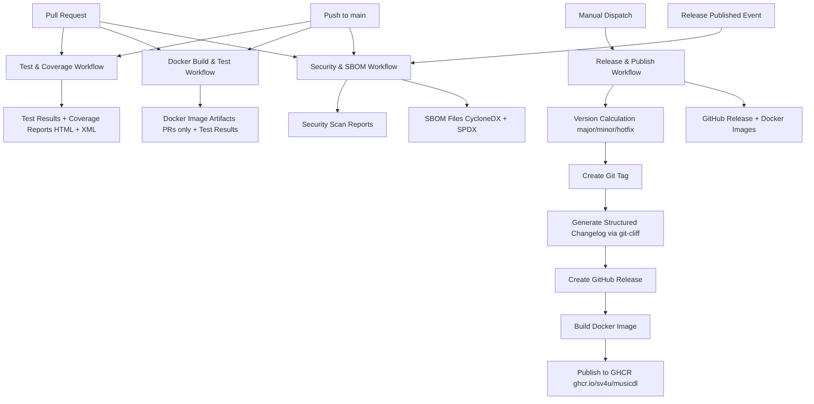

# CI/CD Workflows

## Overview

This project uses GitHub Actions for automated testing, code coverage, Docker image building, and publishing. All workflows run automatically on pull requests and pushes to the `main` branch.

## Workflow Architecture

## Workflows

### 1. Test & Coverage

**Triggers:**

- Pull requests (opened, synchronize, reopened)
- Pushes to `main` branch

**What it does:**

1. Sets up Python 3.12 environment
2. Installs dependencies from `requirements.txt` and `test-requirements.txt`
3. Runs pytest with coverage
4. Generates and uploads coverage reports (HTML and XML)
5. Displays coverage summary

**Artifacts:**

- `coverage-html`: HTML coverage report (7 days retention)
- `coverage-xml`: XML coverage report (7 days retention)

### 2. Docker Build & Test

**Triggers:**

- Pull requests (opened, synchronize, reopened)
- Pushes to `main` branch

**What it does:**

1. Builds Docker image using `musicdl.Dockerfile`
2. Tags images appropriately:
   - PRs: `ghcr.io/sv4u/musicdl:pr-{number}`
   - Main branch: `ghcr.io/sv4u/musicdl:sha-{short-sha}` and `ghcr.io/sv4u/musicdl:latest`
3. **Smoke Tests**:
   - Verifies container can start successfully
   - Tests entrypoint script execution
   - Verifies Python environment (Python 3.12, required packages)
   - Checks required dependencies (ffmpeg, aria2)
   - Verifies directory structure (/scripts, /download)
   - Checks file permissions
4. **Functional Tests**:
   - Creates minimal test configuration
   - Runs download.py with test config
   - Verifies no critical errors occur
5. Saves Docker image as artifact for PRs (for manual testing)

**Artifacts:**

- Docker image artifacts for PRs (1 day retention)

### 3. Security & SBOM

**Triggers:**

- Pull requests (opened, synchronize, reopened)
- Pushes to `main` branch
- Release events (when releases are published)

**What it does:**

**Source Code Security Scanning:**

- Uses **Trivy** to scan repository for vulnerabilities
- Scans dependency files (`requirements.txt`, `test-requirements.txt`)
- Generates security reports in SARIF format
- **Warns on vulnerabilities but does not fail the workflow**

**Docker Image Security Scanning:**

- Uses **Trivy** and **Grype** to scan Docker images
- Generates security reports from both scanners
- Compares results from both scanners
- **Warns on vulnerabilities but does not fail the workflow**

**SBOM Generation from Source Code:**

- Uses **Syft** to generate SBOMs from repository
- Generates SBOMs in CycloneDX and SPDX formats
- Includes all dependencies from `requirements.txt` and `test-requirements.txt`

**SBOM Generation from Docker Image:**

- Uses **Syft** and **Trivy** to generate SBOMs from Docker images
- Generates SBOMs in CycloneDX and SPDX formats
- Includes all packages installed in the Docker image

**For Release Events:**

- Automatically attaches SBOMs to GitHub releases
- Scans the published Docker image from GHCR
- All SBOMs are available as release assets

**Artifacts:**

- Security scan reports (30 days retention)
- SBOM files (30 days retention)

### 4. Release & Publish

**Triggers:**

- Manual dispatch only

**Prerequisites:**

- All changes must be merged to the `main` branch
- Working directory must be clean (no uncommitted changes)
- Local branch must be up-to-date with remote `origin/main`

**How to create a release:**

1. Navigate to the [Actions](https://github.com/sv4u/musicdl/actions) tab in GitHub
2. Select the "Release & Publish" workflow from the left sidebar
3. Click "Run workflow" button (top right)
4. Select the release type:
   - **major**: Increments major version, resets minor to 0 (e.g., v0.13 → v1.0)
   - **minor**: Increments minor version (e.g., v0.13 → v0.14)
   - **hotfix**: Increments patch version (e.g., v0.13.0 → v0.13.1)
5. Optionally enable dry-run mode to test without creating a release
6. Click "Run workflow" to start

**What the Release & Publish workflow does:**

1. Validates branch and working directory state
2. Calculates the next version based on the selected release type (three-part versioning: vX.Y.Z)
3. Validates that there are commits to include in the release
4. Displays a preview of the release (version, commit count, commit types)
5. Checks if tag already exists (local and remote)
6. Creates and pushes a git tag with the new version
7. Generates structured changelog from Conventional Commits using git-cliff
8. Updates CHANGELOG.md in the repository
9. Creates and publishes GitHub release with structured changelog
10. Verifies the release was created successfully
11. Builds Docker image from `musicdl.Dockerfile` (multi-stage slim build)
12. Publishes Docker image to GHCR with version tag and latest tag
13. Verifies the image was published successfully
14. Displays release summary with URLs

**Version Calculation:**

- The workflow uses **three-part versioning** (vX.Y.Z format, e.g., v0.13.0, v1.0.0)
- **Major release**: Increments major, resets minor and patch to 0 (e.g., v0.13.0 → v1.0.0)
- **Minor release**: Increments minor, resets patch to 0 (e.g., v0.13.0 → v0.14.0)
- **Hotfix/Patch release**: Increments patch (e.g., v0.13.0 → v0.13.1)
- **First release**: Defaults to v0.0.1 regardless of release type
- Version format is validated to match `^v[0-9]+\.[0-9]+\.[0-9]+$` pattern

**Tag Handling:**

- Checks for existing tags (local and remote) before creation to prevent duplicates
- Automatically rolls back tags if release or Docker publish fails after tag creation
- Provides manual cleanup instructions if automatic rollback fails

**Published Images:**

Published Docker images are available at:

- `ghcr.io/sv4u/musicdl:v{version}` (e.g., `ghcr.io/sv4u/musicdl:v0.14.0`)
- `ghcr.io/sv4u/musicdl:latest` (always points to the latest published version)

**Dry-Run Mode:**

The Release & Publish workflow supports a dry-run mode that allows you to test the entire release process without creating tags, releases, or publishing images.

**What runs in dry-run mode:**

- ✅ Branch and working directory validation
- ✅ Version calculation and validation (three-part versioning)
- ✅ Commit range checking (warnings instead of errors if no commits)
- ✅ Tag availability checking
- ✅ Preview of what would be created

**What is skipped in dry-run mode:**

- ❌ Git tag creation and pushing
- ❌ GitHub release creation
- ❌ Docker image building and publishing

## Dependency Management

This project uses [Dependabot](https://docs.github.com/en/code-security/dependabot) to automatically manage dependency updates.

### Current Configuration

- **Security Updates**: Enabled - Automatically creates PRs for security vulnerabilities
- **Version Updates**: Disabled - Configuration ready in `.github/dependabot.yml`
- **Update Schedule**: Weekly on Mondays at 9:00 AM UTC
- **Package Managers**: pip (Python), Docker, GitHub Actions

### Enabling Version Updates

To enable automatic version updates:

1. Navigate to [Repository Settings → Security](https://github.com/sv4u/musicdl/settings/security)
2. Under "Code security and analysis", find "Dependabot version updates"
3. Click "Enable" to activate version updates
4. The configuration in `.github/dependabot.yml` will automatically take effect

### Configuration Details

The Dependabot configuration (`.github/dependabot.yml`) includes:

- **Grouping**: Related dependencies are grouped into single PRs
- **Update Limits**: Maximum 5 PRs for pip, 3 for Docker/GitHub Actions
- **Commit Format**: Uses conventional commits (`deps:` for dependencies, `ci:` for GitHub Actions)
- **Labels**: Automatic labeling for easy filtering
- **Ignore Rules**: Major version updates are ignored to prevent breaking changes

## Troubleshooting

### Release Workflow Issues

**Issue: Docker workflow not triggering after release:**

- ✅ Check `RELEASE_PAT` secret exists in repository settings (no longer required - uses GITHUB_TOKEN)
- ✅ Review release workflow logs for warnings
- ✅ Manually trigger Docker workflow if needed (Actions → Docker Publish)

**Issue: Dry-run mode failing unexpectedly:**

- ✅ Check workflow logs for specific error message
- ✅ Verify you're on `main` branch and up-to-date with remote
- ✅ Ensure working directory is clean (no uncommitted changes)
- ✅ Check for syntax errors in workflow file

**Issue: Release creation failing with authentication error:**

- ✅ Verify `GITHUB_TOKEN` has correct permissions (contents: write, packages: write)
- ✅ Check GitHub API status for outages

**Issue: Tag rollback not working:**

- ✅ Check workflow logs for rollback step execution
- ✅ Verify tag exists before attempting deletion
- ✅ Check repository permissions (contents: write required)
- ✅ Manually delete tag if automatic rollback fails: `git push origin :refs/tags/vX.Y.Z`
