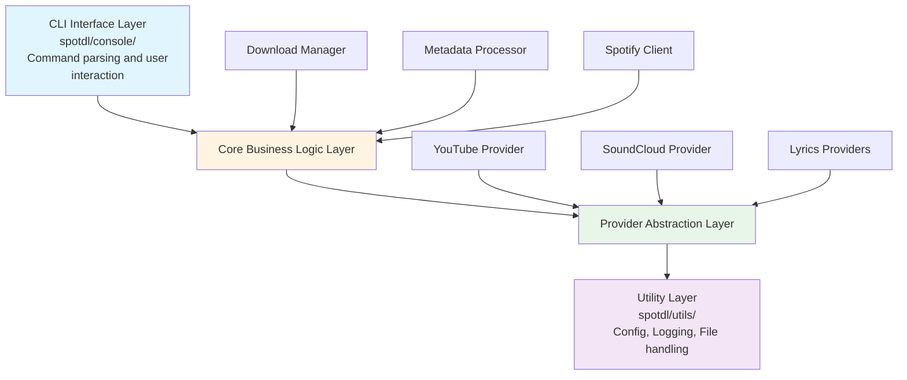
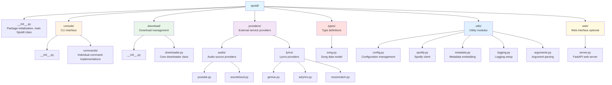

# spotDL Application Analysis

## Table of Contents

- [Overview](#overview)
- [Architecture](#architecture)
- [Implementation Analysis](#implementation-analysis)
- [Configuration File Structure](#configuration-file-structure)
- [Library API Structure and Usage](#library-api-structure-and-usage)
- [References](#references)

## Overview

**spotDL** (v4.4.3) is a Python-based command-line application that downloads
music from Spotify playlists, albums, and tracks by sourcing audio from YouTube
and other providers. The application extracts metadata from Spotify (including
album art, track information, and lyrics) and embeds it into downloaded audio
files.

**Key Features:**

- Downloads tracks, albums, and playlists from Spotify
- Sources audio from YouTube Music, SoundCloud, BandCamp, Piped, and other providers
- Embeds metadata (album art, lyrics, track information)
- Supports multiple audio formats (MP3, FLAC, M4A, Opus, etc.)
- Primarily designed as a CLI tool with command-line interface
- Supports playlist synchronization and metadata updates
- Provides a library API (see Library API section for verified details)

**Repository:**
[https://github.com/spotDL/spotify-downloader](https://github.com/spotDL/spotify-downloader)  
**Documentation:**
[https://spotdl.readthedocs.io/en/latest/](https://spotdl.readthedocs.io/en/latest/)

## Architecture

### High-Level Architecture

spotDL follows a modular, layered architecture designed for maintainability and extensibility:



### Core Components

#### 1. **Console Interface** (`spotdl/console/`)

- Handles command-line argument parsing
- Manages user interactions and feedback
- Supports multiple operations: `download`, `sync`, `save`, `web`, `url`, `meta`
- Provides TUI (Terminal User Interface) for progress display

#### 2. **Download Manager** (`spotdl/download/`)

- Orchestrates the download process
- Manages multi-threaded downloads
- Handles retry logic and error recovery
- Coordinates between Spotify metadata retrieval and audio provider downloads

#### 3. **Spotify Client** (`spotdl/utils/spotify.py`)

- Interfaces with Spotify Web API
- Handles authentication (client credentials or user auth)
- Retrieves track, album, and playlist metadata
- Fetches album art and track information

#### 4. **Audio Providers** (`spotdl/providers/audio/`)

- **YouTube Provider**: Primary source, uses `yt-dlp` for downloads
- **SoundCloud Provider**: Alternative audio source
- Abstract provider interface allows for extensibility

#### 5. **Lyrics Providers** (`spotdl/providers/lyrics/`)

- **Genius**: Primary lyrics source
- **AZLyrics**: Alternative lyrics provider
- **Musixmatch**: Additional lyrics source
- Fallback mechanism if primary provider fails

#### 6. **Metadata Processor** (`spotdl/utils/metadata.py`)

- Embeds metadata into audio files using `mutagen`
- Handles album art embedding
- Manages ID3 tags and other format-specific metadata
- Supports multiple audio formats (MP3, FLAC, M4A, etc.)

#### 7. **Utilities** (`spotdl/utils/`)

- **Configuration Manager**: Loads and manages settings
- **Logging**: Structured logging with configurable levels
- **File Handling**: Path management, filename sanitization
- **Caching**: Manages download cache and skip files

### Data Flow

1. **Input**: User provides Spotify URL or search query via CLI
2. **Spotify Query**: Application queries Spotify API for track/playlist metadata
3. **Provider Search**: Searches YouTube/other providers for matching audio
4. **Audio Download**: Downloads audio stream from provider
5. **Metadata Embedding**: Embeds Spotify metadata and lyrics into audio file
6. **File Output**: Saves file with configured naming pattern

## Implementation Analysis

### Technology Stack

**Core Dependencies:**

- **Python 3.8+**: Base runtime
- **spotipy** (2.25.1): Spotify Web API client
- **yt-dlp** (2025.3.31): YouTube downloader (fork of youtube-dl)
- **mutagen** (1.47.0): Audio metadata manipulation
- **pydantic** (2.11.3): Configuration validation and data modeling
- **rich** (13.9.4): Terminal UI and formatting
- **click** (8.1.8): CLI framework

**Additional Dependencies:**

- **ytmusicapi** (1.10.3): YouTube Music API access
- **soundcloud-v2** (1.6.0): SoundCloud API client
- **syncedlyrics** (1.0.1): Synchronized lyrics support
- **fastapi** (0.103.2): Web interface support
- **redis** (5.2.1): Caching backend (optional)

### Design Patterns

#### 1. **Provider Pattern**

Audio and lyrics providers implement a common interface, allowing easy addition
of new sources:

```python
# Conceptual structure
class AudioProvider(ABC):
    @abstractmethod
    def search(self, query: str) -> List[AudioResult]:
        pass

    @abstractmethod
    def download(self, url: str) -> AudioFile:
        pass
```

#### 2. **Singleton Pattern**

Spotify client uses singleton pattern to maintain single authenticated instance:

```python
# Conceptual usage
SpotifyClient.init(client_id, client_secret)
spotify = SpotifyClient()  # Returns same instance
```

#### 3. **Strategy Pattern**

Different download strategies for tracks, albums, and playlists, with shared
core logic.

#### 4. **Factory Pattern**

Settings/Options objects created from various sources (CLI args, config file,
environment variables).

### Key Implementation Details

#### Download Process

1. **URL Parsing**: Extracts Spotify entity type (track/album/playlist) and ID
2. **Metadata Retrieval**: Fetches full metadata from Spotify API
3. **Provider Selection**: Chooses best matching audio provider based on configuration
4. **Search & Match**: Searches provider for matching audio using track metadata
5. **Audio Stream Download**: Downloads audio stream using `yt-dlp` or
   provider-specific client
6. **Format Conversion**: Converts to desired format using FFmpeg (if needed)
7. **Metadata Embedding**: Embeds Spotify metadata, album art, and lyrics
8. **File Naming**: Applies configured naming pattern and saves file

#### Threading Model

- Supports configurable number of download threads
- Each thread handles one download at a time
- Thread pool manages concurrent downloads
- Progress tracking synchronized across threads

#### Error Handling

- Retry mechanism with exponential backoff
- Graceful degradation (falls back to alternative providers)
- Detailed error logging with context
- Continues processing remaining items on individual failures

#### Caching

- Caches Spotify API responses to reduce API calls
- Skip file support to avoid re-downloading existing files
- Archive file tracking for sync operations

### File Organization



## Configuration File Structure

### Configuration File Location

spotDL uses a JSON configuration file located at platform-specific paths:

- **Windows**: `%APPDATA%\spotdl\config.json`
- **macOS**: `~/Library/Application Support/spotdl/config.json`
- **Linux**: `~/.config/spotdl/config.json`

The configuration can be generated using:

```bash
spotdl --generate-config
```

### Configuration Schema

The configuration file contains the following sections and settings:

#### Authentication Settings

```json
{
  "client_id": "string",           // Spotify API client ID (required)
  "client_secret": "string",       // Spotify API client secret (required)
  "auth_token": "string|null",     // Pre-generated auth token (optional)
  "user_auth": boolean,            // Use user authentication (default: false)
  "cookie_file": "string|null"     // Path to cookies file for providers (optional)
}
```

#### Audio Provider Settings

```json
{
  "audio_providers": ["youtube-music", "soundcloud"], // Provider priority list
  "lyrics_providers": ["genius", "azlyrics", "musixmatch"], // Lyrics source priority
  "bitrate": "128k|192k|256k|320k", // Audio bitrate (default: "128k")
  "format": "mp3|flac|m4a|opus", // Output audio format (default: "mp3")
  "ffmpeg": "ffmpeg", // FFmpeg executable path
  "ffmpeg_args": "string|null" // Additional FFmpeg arguments (optional)
}
```

#### Download Behavior Settings

```json
{
  "threads": integer,               // Number of parallel downloads (default: 1)
  "max_retries": integer,          // Maximum retry attempts (default: 3)
  "output": "string",               // File naming template (see below)
  "overwrite": "skip|overwrite|metadata",  // File overwrite behavior
  "restrict": "ascii|unicode",      // Filename character restriction
  "redownload": boolean,            // Force re-download existing files
  "sync_without_deleting": boolean  // Sync without deleting removed tracks
}
```

#### Output Format Template

The `output` field uses a template system with placeholders:

```text
{artist}/{album}/{disc-number}{track-number} - {title}.{output-ext}
```

**Available Placeholders:**

- `{artist}` - Artist name
- `{album}` - Album name
- `{title}` - Track title
- `{track-number}` - Track number (zero-padded)
- `{disc-number}` - Disc number (zero-padded)
- `{output-ext}` - File extension based on format
- `{album-artist}` - Album artist name
- `{release-date}` - Release date
- `{release-year}` - Release year
- `{genre}` - Genre
- `{explicit}` - Explicit content flag

#### Playlist Settings

```json
{
  "playlist_numbering": boolean,    // Add track numbers to playlist files
  "m3u": "string|null",             // M3U playlist file path (optional)
  "scan_for_songs": boolean,        // Scan directories for existing songs
  "fetch_albums": boolean           // Fetch full albums for playlist tracks
}
```

#### Cache and Performance Settings

```json
{
  "cache_path": "/tmp/spotdl/",     // Cache directory path
  "no_cache": boolean,              // Disable caching
  "use_cache_file": boolean,        // Use persistent cache file
  "archive": "string|null",         // Archive file path for sync
  "save_file": "string|null"        // Save file path for playlist state
}
```

#### Search and Filtering Settings

```json
{
  "search_query": "string|null",           // Custom search query template
  "filter_results": boolean,               // Filter search results
  "only_verified_results": boolean,        // Only use verified results
  "skip_explicit": boolean,                // Skip explicit content
  "detect_formats": "string|null",         // Auto-detect audio formats
  "ignore_albums": "string[]|null"         // List of albums to ignore
}
```

#### UI and Logging Settings

```json
{
  "headless": boolean,              // Run without UI (default: false)
  "simple_tui": boolean,           // Use simple terminal UI (default: true)
  "log_level": "DEBUG|INFO|WARNING|ERROR",  // Logging verbosity
  "log_format": "string|null",     // Custom log format
  "print_errors": boolean          // Print errors to console
}
```

#### Advanced Settings

```json
{
  "sponsor_block": boolean,        // Remove sponsor segments (YouTube)
  "preload": boolean,              // Preload metadata before download
  "id3_separator": "/",            // ID3 tag separator character
  "ytm_data": boolean,             // Use YouTube Music data
  "add_unavailable": boolean,      // Add unavailable tracks to playlists
  "generate_lrc": boolean,         // Generate LRC lyrics files
  "force_update_metadata": boolean, // Force metadata updates
  "max_filename_length": integer|null,  // Maximum filename length
  "yt_dlp_args": "string|null",    // Additional yt-dlp arguments
  "proxy": "string|null"           // Proxy server URL
}
```

#### Web Interface Settings

```json
{
  "port": 8800,                    // Web server port
  "host": "localhost",             // Web server host
  "keep_alive": boolean,           // Keep server alive
  "allowed_origins": "string[]|null",  // CORS allowed origins
  "keep_sessions": boolean,         // Keep user sessions
  "web_use_output_dir": boolean    // Use output directory for web
}
```

### Complete Configuration Example

```json
{
  "client_id": "5f573c9620494bae87890c0f08a60293",
  "client_secret": "212476d9b0f3472eaa762d90b19b0ba8",
  "auth_token": null,
  "user_auth": false,
  "headless": false,
  "cache_path": "/tmp/spotdl/",
  "no_cache": false,
  "max_retries": 3,
  "use_cache_file": false,
  "audio_providers": ["youtube-music", "soundcloud"],
  "lyrics_providers": ["genius", "azlyrics", "musixmatch"],
  "playlist_numbering": false,
  "scan_for_songs": false,
  "m3u": null,
  "output": "{artist}/{album}/{disc-number}{track-number} - {title}.{output-ext}",
  "overwrite": "metadata",
  "search_query": null,
  "ffmpeg": "ffmpeg",
  "bitrate": "128k",
  "ffmpeg_args": null,
  "format": "mp3",
  "save_file": null,
  "filter_results": true,
  "threads": 1,
  "cookie_file": null,
  "restrict": "ascii",
  "print_errors": false,
  "sponsor_block": false,
  "preload": true,
  "archive": null,
  "load_config": true,
  "log_level": "INFO",
  "simple_tui": true,
  "fetch_albums": false,
  "id3_separator": "/",
  "ytm_data": false,
  "add_unavailable": false,
  "generate_lrc": false,
  "force_update_metadata": false,
  "only_verified_results": false,
  "sync_without_deleting": false,
  "max_filename_length": null,
  "yt_dlp_args": null,
  "detect_formats": null,
  "save_errors": null,
  "ignore_albums": null,
  "proxy": null,
  "skip_explicit": false,
  "log_format": null,
  "redownload": false,
  "web_use_output_dir": false,
  "port": 8800,
  "host": "localhost",
  "keep_alive": false,
  "allowed_origins": null,
  "keep_sessions": false
}
```

### Configuration Priority

Settings are loaded in the following priority order (highest to lowest):

1. **Command-line arguments** - Override all other sources
2. **Environment variables** - Prefixed with `SPOTDL_` (e.g., `SPOTDL_THREADS=4`)
3. **Configuration file** - `config.json` in platform-specific location
4. **Default values** - Built-in defaults

## Library API Structure and Usage

> **Important**: spotDL is **primarily designed as a command-line tool**. While
> the codebase contains a `Spotdl` class and supporting modules that can be
> imported, **spotDL does not officially document a public library API**. The
> recommended approach for programmatic usage is to use `subprocess` to call
> the CLI (as implemented in the current musicdl project). However, the library
> API does exist and is used internally by the CLI.

### Package Structure

The spotDL package structure (verified from source code):

```text
spotdl/
├── __init__.py          # Package initialization, exports Spotdl class
├── console/             # CLI interface commands
│   ├── download.py
│   ├── sync.py
│   ├── save.py
│   ├── meta.py
│   ├── url.py
│   └── web.py
├── download/            # Download management
│   ├── downloader.py    # Downloader class
│   └── progress_handler.py
├── utils/               # Utility functions
│   ├── spotify.py       # SpotifyClient class
│   ├── config.py        # Configuration management
│   ├── metadata.py      # Metadata embedding
│   ├── search.py        # Search functionality
│   └── ...
├── types/               # Data type definitions
│   ├── song.py          # Song class
│   ├── options.py       # Options TypedDict classes
│   ├── album.py
│   ├── artist.py
│   └── playlist.py
└── providers/           # Provider implementations
    ├── audio/           # Audio providers (YouTube, SoundCloud, etc.)
    └── lyrics/          # Lyrics providers (Genius, MusixMatch, etc.)
```

**Note**: While these modules exist and can be imported, they are not officially
documented as a public API. The API may change between versions. Use at your own
risk.

### Programmatic Usage

> **Note**: The following API information is **verified from the source code**
> (spotDL v4.4.3). However, **spotDL does not officially document this as a
> public library API**. Use at your own risk, as the API may change between
> versions.

#### Recommended Approach: Subprocess

The recommended way to use spotDL programmatically is through subprocess calls
to the CLI:

```python
import subprocess

# Download a track
subprocess.run([
    "spotdl",
    "download",
    "https://open.spotify.com/track/...",
    "--threads", "4",
    "--format", "mp3"
])
```

This approach is stable, well-tested, and matches spotDL's design as a CLI tool.

#### Library API (Verified from Source Code)

The following classes and methods exist in the spotDL codebase and can be
imported, though they are not officially documented as a public API:

#### 1. **Spotdl Class** (Verified - `spotdl/__init__.py`)

The main entry point for programmatic usage:

```python
from spotdl import Spotdl

# Initialize with required credentials
spotdl = Spotdl(
    client_id="your_client_id",
    client_secret="your_client_secret",
    user_auth=False,  # Optional: use user authentication
    cache_path=None,  # Optional: custom cache path
    no_cache=False,   # Optional: disable caching
    headless=False,   # Optional: run without browser
    downloader_settings=None,  # Optional: DownloaderOptionalOptions dict
    loop=None  # Optional: asyncio event loop
)
```

**Key Methods** (verified from source):

```python
# Search for songs (returns List[Song])
songs = spotdl.search([
    "joji - test drive",
    "https://open.spotify.com/track/4cOdK2wGLETKBW3PvgPWqT"
])

# Download a single song (returns Tuple[Song, Optional[Path]])
song, path = spotdl.download(songs[0])

# Download multiple songs (returns List[Tuple[Song, Optional[Path]]])
results = spotdl.download_songs(songs)

# Get download URLs for songs without downloading (returns List[Optional[str]])
urls = spotdl.get_download_urls(songs)
```

**Verification Status**: ✅ **Verified** - Class exists in `spotdl/__init__.py`
with documented docstrings.

#### 2. **Song Class** (Verified - `spotdl/types/song.py`)

Represents a single track with metadata:

```python
from spotdl.types import Song

# Create from Spotify URL
song = Song.from_url("https://open.spotify.com/track/...")

# Create from search term (returns first result)
song = Song.from_search_term("Artist - Track Name")

# Create list from search term
songs = Song.list_from_search_term("Artist - Track Name")

# Access metadata properties
print(song.name)          # Track title
print(song.artists)       # List[str] of artist names
print(song.artist)        # Primary artist name (str)
print(song.album_name)    # Album name
print(song.album_artist)  # Album artist name
print(song.duration)      # Duration in seconds (int)
print(song.cover_url)     # Album art URL (Optional[str])
print(song.url)           # Spotify URL
print(song.song_id)       # Spotify track ID
print(song.explicit)      # Explicit content flag (bool)
print(song.genres)        # List[str] of genres
print(song.year)          # Release year (int)
print(song.date)          # Release date (str)
print(song.track_number)  # Track number (int)
print(song.disc_number)   # Disc number (int)
print(song.display_name)  # Property: "{artist} - {name}"
print(song.json)          # Property: dict representation
```

**Key Class Methods** (verified from source):

- `Song.from_url(url: str) -> Song` - Create from Spotify URL
- `Song.from_search_term(search_term: str) -> Song` - Create from search (first result)
- `Song.list_from_search_term(search_term: str) -> List[Song]` - Create list
  from search
- `Song.from_dict(data: Dict[str, Any]) -> Song` - Create from dictionary
- `Song.from_data_dump(data: str) -> Song` - Create from JSON string

**Verification Status**: ✅ **Verified** - Class exists in `spotdl/types/song.py`
as a dataclass with verified methods and properties.

#### 3. **Downloader Class** (Verified - `spotdl/download/downloader.py`)

Core download functionality:

```python
from spotdl.download import Downloader
from spotdl.types.options import DownloaderOptionalOptions, DownloaderOptions
from spotdl.types.song import Song

# Initialize with settings (dict or DownloaderOptionalOptions)
settings: DownloaderOptionalOptions = {
    "threads": 4,
    "format": "mp3",
    "bitrate": "320k",
    "output": "{artists} - {title}.{output-ext}",
    "audio_providers": ["youtube-music"],
    "lyrics_providers": ["genius", "azlyrics"],
    # ... other options
}
downloader = Downloader(settings=settings)

# Download a single song
song = Song.from_url("https://open.spotify.com/track/...")
song, path = downloader.download_song(song)

# Download multiple songs
songs = [Song.from_url(url) for url in urls]
results = downloader.download_multiple_songs(songs)

# Search for download URL (without downloading)
download_url = downloader.search(song)

# Search for lyrics
lyrics = downloader.search_lyrics(song)  # Returns Optional[str]
```

**Key Methods** (verified from source):

- `download_song(song: Song) -> Tuple[Song, Optional[Path]]` - Download single song
- `download_multiple_songs(songs: List[Song]) -> List[Tuple[Song, Optional[Path]]]`
  - Download multiple songs
- `search(song: Song) -> str` - Search for download URL
- `search_lyrics(song: Song) -> Optional[str]` - Search for lyrics

**Verification Status**: ✅ **Verified** - Class exists in
`spotdl/download/downloader.py` with verified methods.

#### 4. **SpotifyClient Class** (Verified - `spotdl/utils/spotify.py`)

Spotify API interaction using Singleton pattern:

```python
from spotdl.utils.spotify import SpotifyClient

# Initialize (must be called before using SpotifyClient())
SpotifyClient.init(
    client_id="your_client_id",
    client_secret="your_client_secret",
    user_auth=False,        # Optional: use user authentication
    no_cache=False,         # Optional: disable caching
    headless=False,         # Optional: run without browser
    max_retries=3,          # Optional: API retry count
    use_cache_file=False,   # Optional: use persistent cache file
    auth_token=None,        # Optional: pre-generated auth token
    cache_path=None         # Optional: custom cache path
)

# Get client instance (singleton - returns same instance)
spotify = SpotifyClient()

# Use spotipy methods (inherits from spotipy.Spotify)
track = spotify.track("spotify_track_id")
album = spotify.album("spotify_album_id")
playlist = spotify.playlist("spotify_playlist_id")
artist = spotify.artist("spotify_artist_id")
search_results = spotify.search("query", type="track")
```

**Key Features** (verified from source):

- Uses Singleton metaclass - only one instance exists
- Must call `SpotifyClient.init()` before using `SpotifyClient()`
- Inherits from `spotipy.Spotify` - all spotipy methods available
- Supports caching via `use_cache_file` option
- Supports both client credentials and user authentication

**Verification Status**: ✅ **Verified** - Class exists in
`spotdl/utils/spotify.py` with Singleton pattern implementation.

#### 5. **Options TypedDict Classes** (Verified - `spotdl/types/options.py`)

Configuration is managed through TypedDict classes:

```python
from spotdl.types.options import (
    SpotifyOptions,
    DownloaderOptions,
    WebOptions,
    SpotDLOptions,
    SpotifyOptionalOptions,
    DownloaderOptionalOptions,
    WebOptionalOptions,
    SpotDLOptionalOptions,
)

# Required options (all fields required)
spotify_opts: SpotifyOptions = {
    "client_id": "your_id",
    "client_secret": "your_secret",
    "auth_token": None,
    "user_auth": False,
    "headless": False,
    "cache_path": "/path/to/cache",
    "no_cache": False,
    "max_retries": 3,
    "use_cache_file": False,
}

# Optional options (fields are optional)
downloader_opts: DownloaderOptionalOptions = {
    "threads": 4,
    "format": "mp3",
    "bitrate": "320k",
    # ... other optional fields
}

# Combined options
all_opts: SpotDLOptions = {
    **spotify_opts,
    **downloader_opts,
    # ... web options
}
```

**Key Types** (verified from source):

- `SpotifyOptions` - Required Spotify client options
- `DownloaderOptions` - Required downloader options
- `WebOptions` - Required web server options
- `SpotDLOptions` - Combined required options
- `*OptionalOptions` - Optional versions (all fields optional)

**Verification Status**: ✅ **Verified** - TypedDict classes exist in
`spotdl/types/options.py` with all fields defined.

### Usage Examples

The following examples demonstrate both the **library API approach** (verified
from source) and the **recommended subprocess approach**:

#### Library API Examples (Verified from Source)

#### Example 1: Download a Single Track (Library API)

```python
from spotdl import Spotdl
from spotdl.types.song import Song

# Initialize
spotdl = Spotdl(
    client_id="your_client_id",
    client_secret="your_client_secret"
)

# Search and download
songs = spotdl.search(["https://open.spotify.com/track/4uLU6hMCjMI75M1A2tKUQC"])
song, path = spotdl.download(songs[0])

if path:
    print(f"Downloaded: {path}")
else:
    print(f"Failed to download: {song.display_name}")
```

#### Example 1b: Download a Single Track (Subprocess - Recommended)

```python
import subprocess

def download_track(url):
    """Download a single track using spotDL CLI."""
    result = subprocess.run(
        ["spotdl", "download", url],
        capture_output=True,
        text=True
    )
    
    if result.returncode != 0:
        raise RuntimeError(f"Download failed: {result.stderr}")
    
    return result.stdout

# Usage
download_track("https://open.spotify.com/track/4uLU6hMCjMI75M1A2tKUQC")
```

#### Example 2: Download a Playlist with Custom Settings (Library API)

```python
from spotdl import Spotdl
from spotdl.types.options import DownloaderOptionalOptions

# Initialize with custom downloader settings
downloader_settings: DownloaderOptionalOptions = {
    "threads": 4,
    "format": "mp3",
    "bitrate": "320k",
    "output": "{artists} - {title}.{output-ext}",
    "audio_providers": ["youtube-music"],
    "lyrics_providers": ["genius", "azlyrics"],
}

spotdl = Spotdl(
    client_id="your_client_id",
    client_secret="your_client_secret",
    downloader_settings=downloader_settings
)

# Search and download playlist
songs = spotdl.search(["https://open.spotify.com/playlist/37i9dQZF1DXcBWIGoYBM5M"])
results = spotdl.download_songs(songs)

# Process results
for song, path in results:
    if path:
        print(f"Downloaded: {song.display_name} -> {path}")
    else:
        print(f"Failed: {song.display_name}")
```

#### Example 2b: Download a Playlist with Custom Settings (Subprocess - Recommended)

```python
import subprocess

def download_playlist(url, config):
    """Download a playlist with custom settings."""
    cmd = [
        "spotdl", "download", url,
        "--threads", str(config.get("threads", 4)),
        "--format", config.get("format", "mp3"),
        "--bitrate", config.get("bitrate", "320k"),
        "--max-retries", str(config.get("max_retries", 5)),
        "--output", config.get("output", "{artist}/{album}/{title}.{output-ext}")
    ]
    
    result = subprocess.run(cmd, capture_output=True, text=True)
    
    if result.returncode != 0:
        raise RuntimeError(f"Download failed: {result.stderr}")
    
    return result.stdout

# Usage
config = {
    "threads": 4,
    "format": "mp3",
    "bitrate": "320k",
    "max_retries": 5
}
download_playlist("https://open.spotify.com/playlist/37i9dQZF1DXcBWIGoYBM5M", config)
```

#### Example 3: Batch Download with Error Handling (Library API)

```python
from spotdl import Spotdl
from spotdl.utils.spotify import SpotifyError
from spotdl.download.downloader import DownloaderError

spotdl = Spotdl(
    client_id="your_client_id",
    client_secret="your_client_secret"
)

urls = [
    "https://open.spotify.com/track/...",
    "https://open.spotify.com/track/...",
    "https://open.spotify.com/track/..."
]

try:
    # Search for all songs
    songs = spotdl.search(urls)
    
    # Download all songs
    results = spotdl.download_songs(songs)
    
    # Process results
    for song, path in results:
        if path:
            print(f"Successfully downloaded: {song.display_name}")
        else:
            print(f"Failed to download: {song.display_name}")
except SpotifyError as e:
    print(f"Spotify error: {e}")
except DownloaderError as e:
    print(f"Download error: {e}")
except Exception as e:
    print(f"Unexpected error: {e}")
```

#### Example 3b: Batch Download with Error Handling (Subprocess - Recommended)

```python
import subprocess

def download_tracks(urls, config=None):
    """Download multiple tracks with error handling."""
    if config is None:
        config = {}
    
    results = {"success": [], "failed": []}
    
    for url in urls:
        try:
            cmd = ["spotdl", "download", url]
            if "threads" in config:
                cmd.extend(["--threads", str(config["threads"])])
            
            result = subprocess.run(cmd, capture_output=True, text=True)
            
            if result.returncode == 0:
                results["success"].append(url)
                print(f"Successfully downloaded: {url}")
            else:
                results["failed"].append((url, result.stderr))
                print(f"Failed to download {url}: {result.stderr}")
        except Exception as e:
            results["failed"].append((url, str(e)))
            print(f"Error downloading {url}: {e}")
    
    return results

# Usage
urls = [
    "https://open.spotify.com/track/...",
    "https://open.spotify.com/track/...",
    "https://open.spotify.com/track/..."
]
results = download_tracks(urls, {"threads": 4})
```

#### Example 4: Using Song Class Directly (Library API)

```python
from spotdl.types.song import Song
from spotdl.utils.spotify import SpotifyClient

# Initialize Spotify client
SpotifyClient.init(
    client_id="your_client_id",
    client_secret="your_client_secret"
)

# Create song from URL
song = Song.from_url("https://open.spotify.com/track/...")

# Access metadata
print(f"Title: {song.name}")
print(f"Artist: {song.artist}")
print(f"Album: {song.album_name}")
print(f"Duration: {song.duration} seconds")
print(f"Cover: {song.cover_url}")

# Create from search
song2 = Song.from_search_term("Artist - Track Name")
print(f"Found: {song2.display_name}")
```

#### Example 4b: Using Configuration File (Subprocess - Recommended)

```python
import subprocess
import json

def download_with_config(url, config_file_path):
    """Download using spotDL with a configuration file."""
    # Load config
    with open(config_file_path, 'r') as f:
        config = json.load(f)
    
    # Build command with config values
    cmd = ["spotdl", "download", url]
    
    # Add config options to command
    if "threads" in config:
        cmd.extend(["--threads", str(config["threads"])])
    if "format" in config:
        cmd.extend(["--format", config["format"]])
    if "bitrate" in config:
        cmd.extend(["--bitrate", config["bitrate"]])
    if "output" in config:
        cmd.extend(["--output", config["output"]])
    
    result = subprocess.run(cmd, capture_output=True, text=True)
    
    if result.returncode != 0:
        raise RuntimeError(f"Download failed: {result.stderr}")
    
    return result.stdout

# Usage
download_with_config(
    "https://open.spotify.com/track/...",
    "config.json"
)
```

#### Example 5: Get Download URLs Without Downloading (Library API)

```python
from spotdl import Spotdl

spotdl = Spotdl(
    client_id="your_client_id",
    client_secret="your_client_secret"
)

# Search for songs
songs = spotdl.search([
    "https://open.spotify.com/track/...",
    "https://open.spotify.com/track/..."
])

# Get download URLs without downloading
urls = spotdl.get_download_urls(songs)

for song, url in zip(songs, urls):
    if url:
        print(f"{song.display_name}: {url}")
    else:
        print(f"{song.display_name}: No URL found")
```

#### Example 5b: Sync Playlist (Subprocess - Recommended)

```python
import subprocess

def sync_playlist(playlist_url, save_file):
    """Sync local directory with Spotify playlist."""
    cmd = [
        "spotdl", "sync", playlist_url,
        "--save-file", save_file
    ]
    
    result = subprocess.run(cmd, capture_output=True, text=True)
    
    if result.returncode != 0:
        raise RuntimeError(f"Sync failed: {result.stderr}")
    
    return result.stdout

# Usage
sync_playlist(
    "https://open.spotify.com/playlist/...",
    "playlist.spotdl"
)
```

### API Design Patterns

#### 1. **Singleton Pattern** (Verified)

`SpotifyClient` uses a Singleton metaclass to ensure only one instance exists:

```python
# Must initialize first
SpotifyClient.init(client_id="...", client_secret="...")

# All calls return the same instance
client1 = SpotifyClient()
client2 = SpotifyClient()
assert client1 is client2  # True
```

#### 2. **Provider Pattern** (Verified)

Audio and lyrics providers implement base classes for extensibility:

```python
from spotdl.providers.audio import AudioProvider, YouTube, YouTubeMusic, SoundCloud
from spotdl.providers.lyrics import LyricsProvider, Genius, MusixMatch, AzLyrics

# Providers are registered in Downloader class
# Downloader automatically tries providers in order until one succeeds
```

#### 3. **Async Support** (Verified - Internal)

The `Downloader` class uses asyncio internally for concurrent downloads:

```python
# Downloader uses asyncio.Semaphore to limit concurrent downloads
# The `threads` setting controls the semaphore limit
# Downloads run in an event loop with thread pool executor
```

**Note**: While spotDL uses async internally, the public API (`Spotdl` class) is
synchronous. The async implementation is an internal detail.

### API Error Handling

spotDL defines custom exception classes for different error types:

```python
from spotdl.utils.spotify import SpotifyError
from spotdl.download.downloader import DownloaderError
from spotdl.utils.metadata import MetadataError
from spotdl.utils.ffmpeg import FFmpegError
from spotdl.utils.config import ConfigError
from spotdl.types.song import SongError, SongListError
from spotdl.providers.audio.base import AudioProviderError

# Usage example
try:
    spotdl = Spotdl(client_id="...", client_secret="...")
    songs = spotdl.search(["query"])
    results = spotdl.download_songs(songs)
except SpotifyError as e:
    # Handle Spotify API errors
    print(f"Spotify error: {e}")
except DownloaderError as e:
    # Handle download errors
    print(f"Download error: {e}")
except MetadataError as e:
    # Handle metadata embedding errors
    print(f"Metadata error: {e}")
except SongError as e:
    # Handle song-related errors
    print(f"Song error: {e}")
```

**Exception Classes** (verified from source):

- `SpotifyError` - `spotdl/utils/spotify.py` - Spotify API errors
- `DownloaderError` - `spotdl/download/downloader.py` - Download failures
- `MetadataError` - `spotdl/utils/metadata.py` - Metadata embedding errors
- `FFmpegError` - `spotdl/utils/ffmpeg.py` - FFmpeg conversion errors
- `ConfigError` - `spotdl/utils/config.py` - Configuration errors
- `SongError` - `spotdl/types/song.py` - Song-related errors
- `SongListError` - `spotdl/types/song.py` - Song list errors
- `AudioProviderError` - `spotdl/providers/audio/base.py` - Audio provider errors

**Verification Status**: ✅ **Verified** - Exception classes exist in their
respective modules.

### Integration Considerations

#### Recommended Approach

**Use subprocess to call the CLI** - This is the stable, documented, and
recommended approach:

```python
import subprocess
import json

def download_with_spotdl(url, config):
    """Download using spotDL CLI via subprocess."""
    cmd = [
        "spotdl",
        "download",
        url,
        "--threads", str(config.get("threads", 1)),
        "--format", config.get("format", "mp3"),
        "--bitrate", config.get("bitrate", "128k"),
        "--output", config.get("output", "{artist}/{album}/{title}.{output-ext}")
    ]
    
    result = subprocess.run(cmd, capture_output=True, text=True)
    
    if result.returncode != 0:
        raise RuntimeError(f"spotDL failed: {result.stderr}")
    
    return result.stdout
```

#### Thread Safety

- When using subprocess, each call is independent and thread-safe
- Use the `--threads` CLI option for parallel downloads within a single command
- Multiple subprocess calls can run concurrently

#### Resource Management

- Each subprocess call manages its own resources
- FFmpeg processes are spawned per download
- Cache files are managed by spotDL automatically

#### Performance

- Use `--threads` CLI option for parallel downloads
- Enable caching via `--cache-path` option
- Use `--preload` option to fetch metadata in batch before downloading

## References

### Official Resources

- **GitHub Repository**: [https://github.com/spotDL/spotify-downloader](https://github.com/spotDL/spotify-downloader)
- **Documentation**: [https://spotdl.readthedocs.io/en/latest/](https://spotdl.readthedocs.io/en/latest/)
- **PyPI Package**: [https://pypi.org/project/spotdl/](https://pypi.org/project/spotdl/)

### Key Dependencies

- **spotipy**: [https://github.com/plamere/spotipy](https://github.com/plamere/spotipy)
- **yt-dlp**: [https://github.com/yt-dlp/yt-dlp](https://github.com/yt-dlp/yt-dlp)
- **mutagen**: [https://github.com/quodlibet/mutagen](https://github.com/quodlibet/mutagen)
- **pydantic**: [https://github.com/pydantic/pydantic](https://github.com/pydantic/pydantic)

### Version Information

- **spotDL Version Analyzed**: 4.4.3 (verified from `spotdl/_version.py` in
  source code)
- **Source Code Location**: `spotdl/` directory (cloned repository)
- **Python Requirement**: 3.8+ (verify current requirements in [official documentation](https://spotdl.readthedocs.io/en/latest/))
- **Last Updated**: Based on repository state and documentation as of analysis date

---

**Important Notes**:

1. This analysis is based on **spotDL v4.4.3** (verified from source code in
   `spotdl/` directory).

2. The **Library API Structure and Usage** section contains **verified
   information from the source code**. However:
   - spotDL does not officially document this as a public library API
   - The API may change between versions without notice
   - The recommended approach for programmatic usage is still **subprocess**
     (stable, documented)

3. **spotDL is primarily a CLI tool, but provides a library API**:
   - ✅ **Library API exists** - `Spotdl` class and supporting modules can be
     imported and used
   - ✅ **Verified from source** - All classes, methods, and exceptions
     documented above exist in the codebase
   - ⚠️ **Not officially documented** - While the API exists, it's not
     documented as a public API
   - ✅ **Recommended**: Use subprocess for production use (stable, documented
     approach)
   - ⚠️ **Use with caution**: Library API may change between versions
